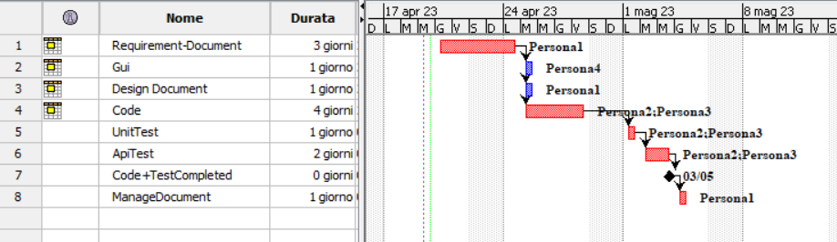

# Project Estimation - CURRENT
Date: 19/04/2023

Version: 1.0

# Estimation approach
Consider the EZWallet  project in CURRENT version (as received by the teachers), assume that you are going to develop the project INDEPENDENT of the deadlines of the course
# Estimate by size
### 
|             | Estimate                        |             
| ----------- | ------------------------------- |  
| NC =  Estimated number of classes to be developed   |         12                    |             
|  A = Estimated average size per class, in LOC       |                        71    | 
| S = Estimated size of project, in LOC (= NC * A) | 850 |
| E = Estimated effort, in person hours (here use productivity 10 LOC per person hour)  |   85ph                                   |   
| C = Estimated cost, in euro (here use 1 person hour cost = 30 euro) |2550 | 
| Estimated calendar time, in calendar weeks (Assume team of 4 people, 8 hours per day, 5 days per week ) |               1 week     |               

# Estimate by product decomposition
### 
|         component name    | Estimated effort (person hours)   |             
| ----------- | ------------------------------- | 
|requirement document    | 24 |
| GUI prototype |6|
|design document |5|
|code |50|
| unit tests |10|
| api tests |25|
| management documents  | 5|

# Estimate by activity decomposition
### 
|         Activity name    | Estimated effort (person hours)   |             
| ----------- | ------------------------------- | 

# Summary

Report here the results of the three estimation approaches. The  estimates may differ. Discuss here the possible reasons for the difference

|             | Estimated effort                        |   Estimated duration |          
| ----------- | ------------------------------- | ---------------|
| estimate by size |85ph | 1 week
| estimate by product decomposition |125ph| 1 week + 2 days
| estimate by activity decomposition |125ph|2 week

The difference between the product and activity decomposition is that in the first one, the work was synchronised, whereas in the latter, the work was mainly asynchronous.

