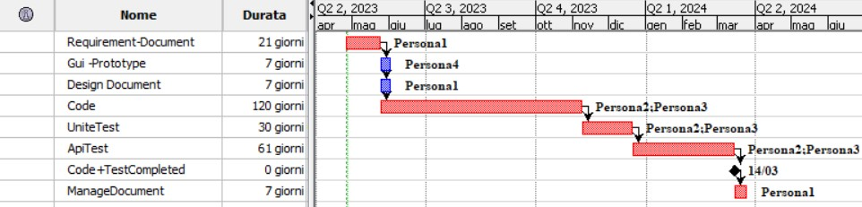

# Project Estimation - FUTURE
Date: 26/04/2023

Version: 2.1

# Estimation approach
Consider the EZWallet  project in FUTURE version (as proposed by the team), assume that you are going to develop the project INDEPENDENT of the deadlines of the course
# Estimate by size 
### 
|             | Estimate                        |             
| ----------- | ------------------------------- |  
| NC =  Estimated number of classes to be developed  64|                             |             
|  A = Estimated average size per class, in LOC       |     400                       | 
| S = Estimated size of project, in LOC (= NC * A) |25600  |
| E = Estimated effort, in person hours (here use productivity 10 LOC per person hour)  |              2560ph                        |   
| C = Estimated cost, in euro (here use 1 person hour cost = 30 euro) |76.800 euro| 
| Estimated calendar time, in calendar weeks (Assume team of 4 people, 8 hours per day, 5 days per week ) | 16  weeks         |               

# Estimate by product decomposition
### 
|         component name    | Estimated effort (person hours)   |             
| ----------- | ------------------------------- | 
|requirement document    |168 |
| GUI prototype |40|
|design document |35|
|code |1505|
| unit tests |300|
| api tests |755|
| management documents  |35|

# Estimate by activity decomposition
### 
|         Activity name    | Estimated effort (person hours)   |             
| ----------- | ------------------------------- | 

# Summary

Report here the results of the three estimation approaches. The  estimates may differ. Discuss here the possible reasons for the difference

|             | Estimated effort                        |   Estimated duration |          
| ----------- | ------------------------------- | ---------------|
| estimate by size |2560ph| 16 weeks
| estimate by product decomposition |2838ph| 18 weeks
| estimate by activity decomposition |2838| 47 weeks

The difference between the product and activity decomposition is that in the first one, the work was synchronised, whereas in the latter, the work was mainly asynchronous.

