# Graphical User Interface Prototype  - FUTURE

Authors:Group14

Date: 27/04/2023

Version:v2
   

## Login
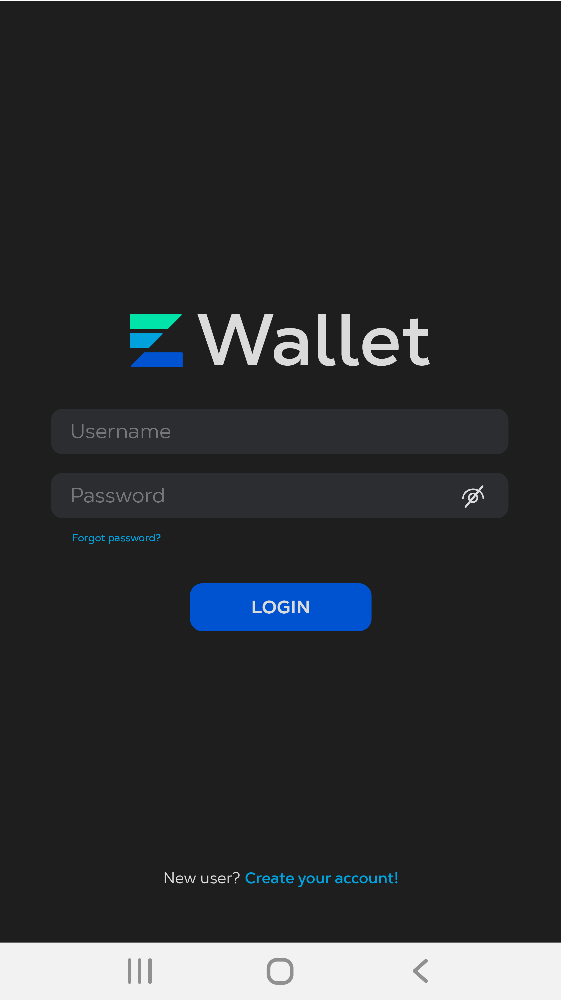

## Logout+Edit Profile
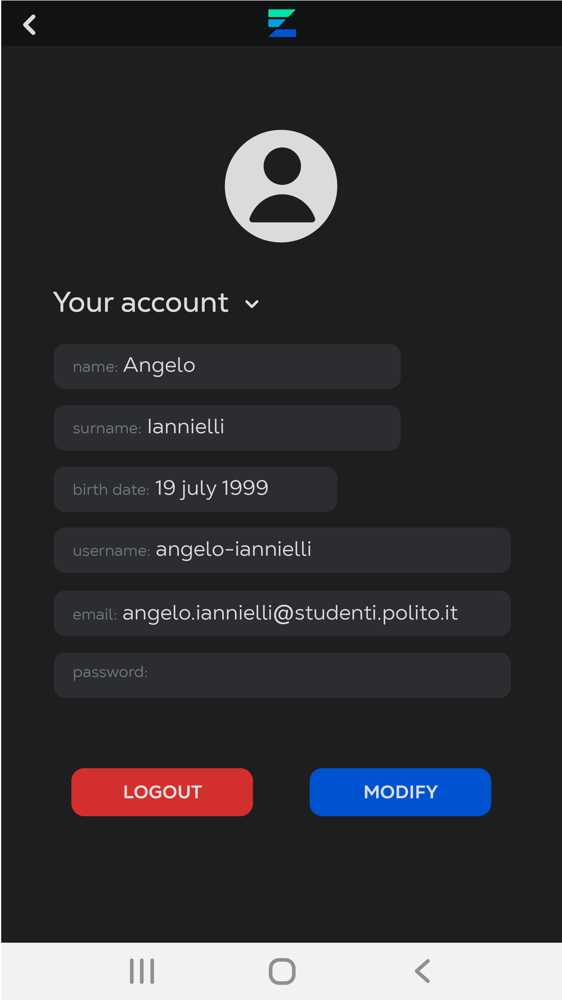

## Create Accounts
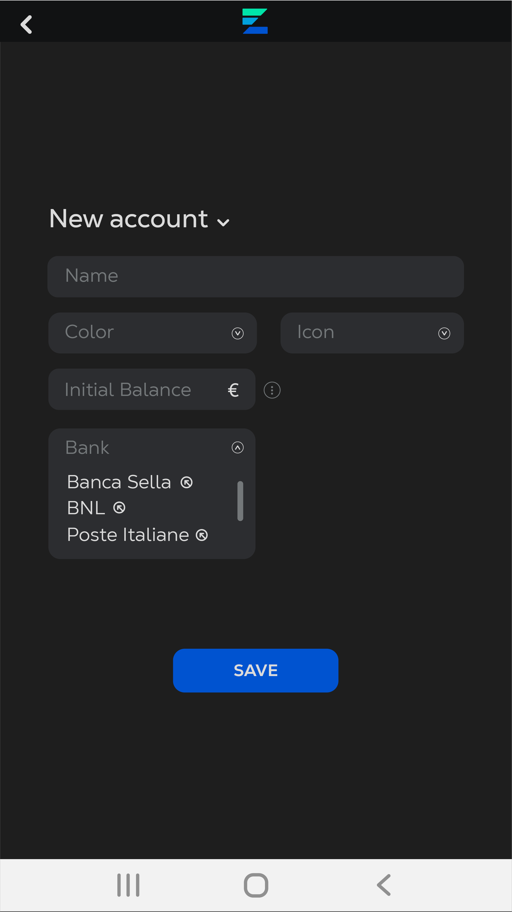
## Get Accounts List
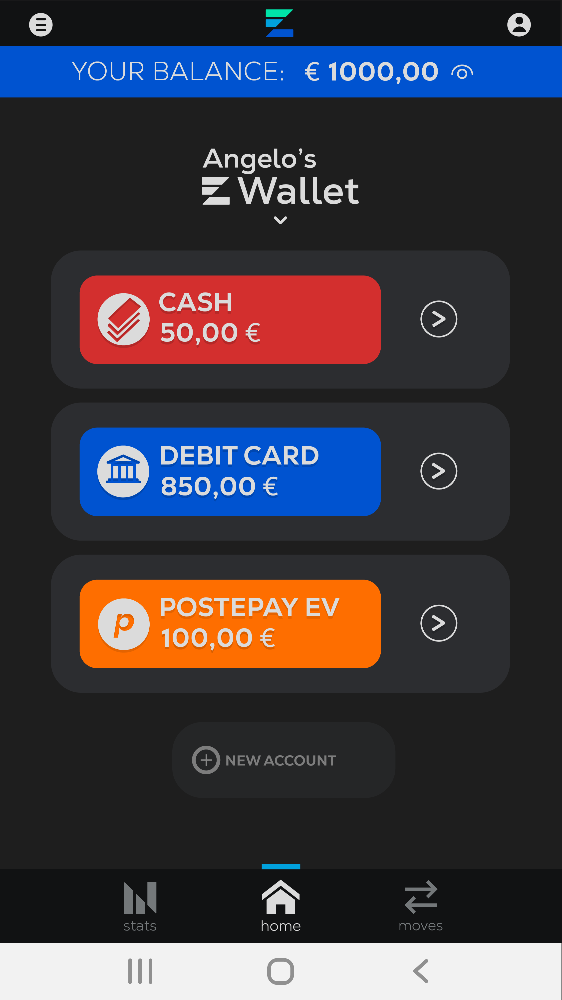

## Get Transactions List
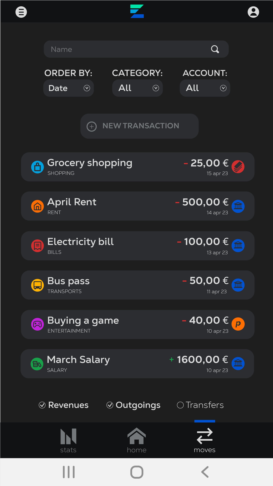

##  ViewStats
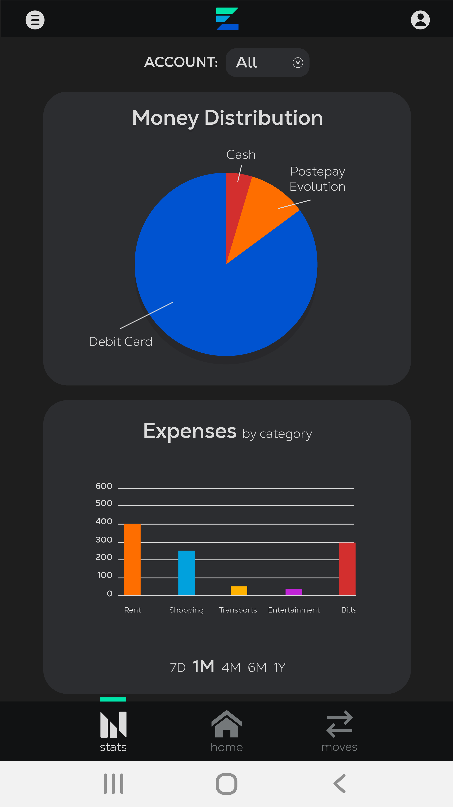

## Create Transaction
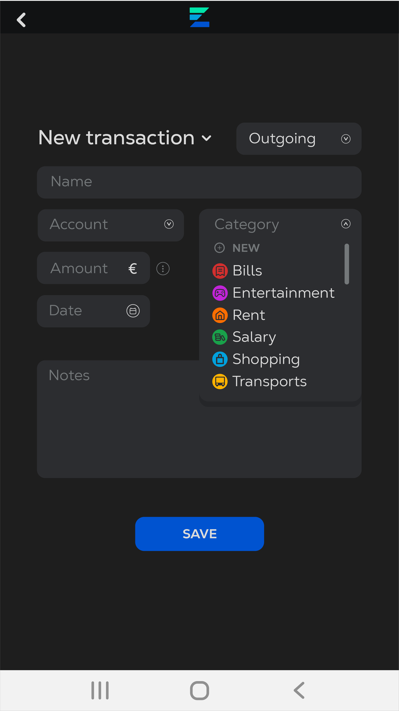

## Create Transaction
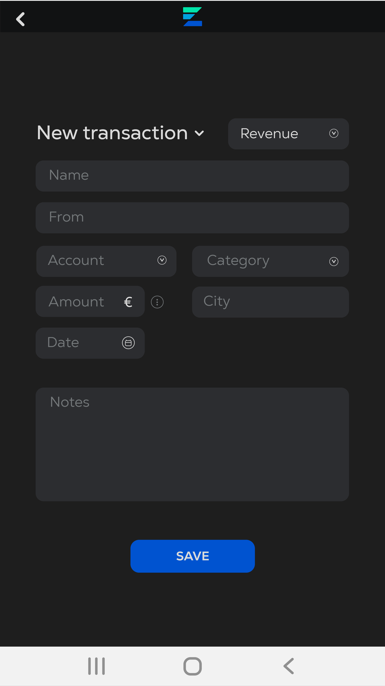

## Create Transaction
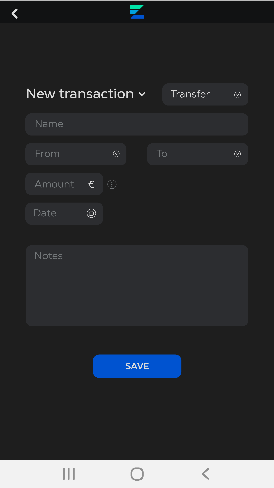

## Create Transaction (create category)

## Create Reminder

## Edit Transaction
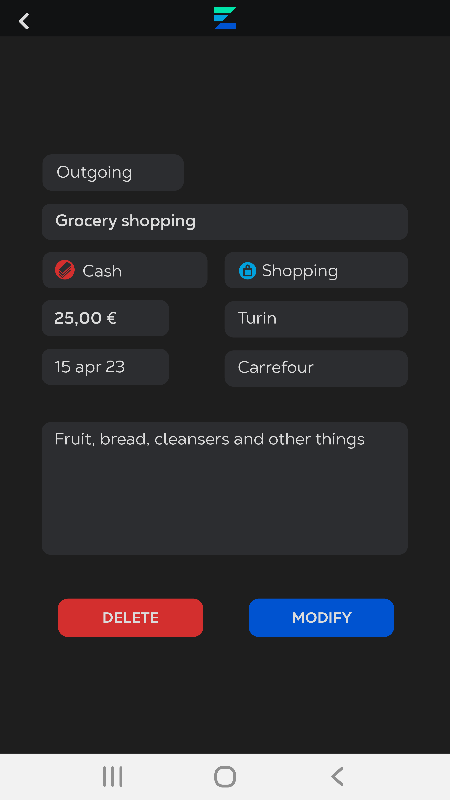

## Set Budget/Language/Notification
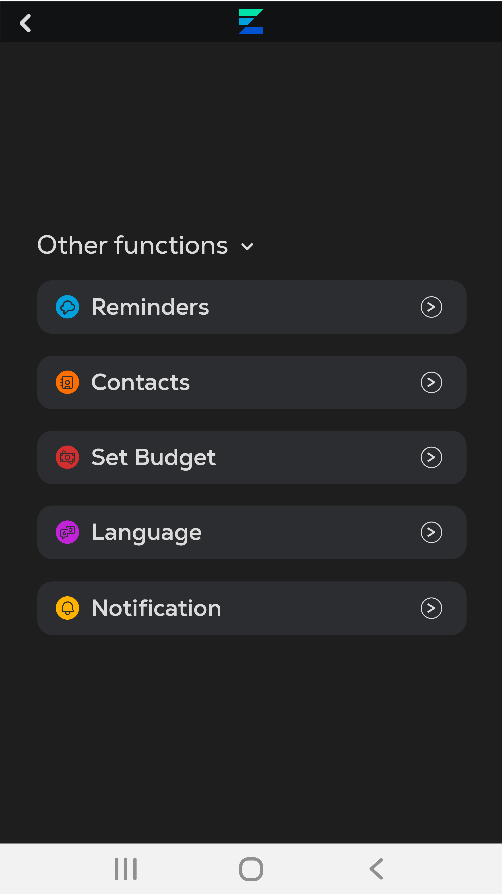

## Contacts Management
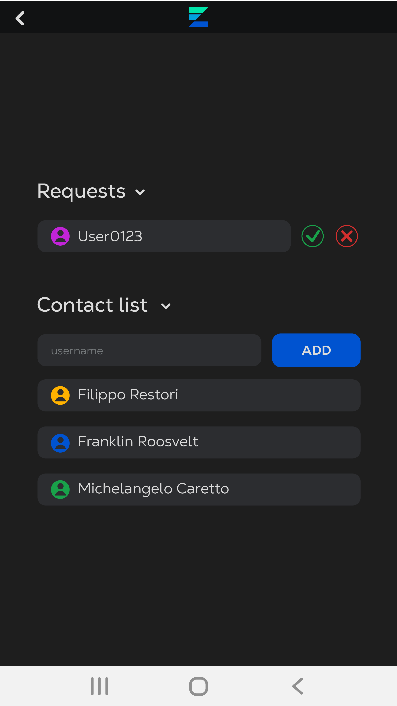

## GetReports
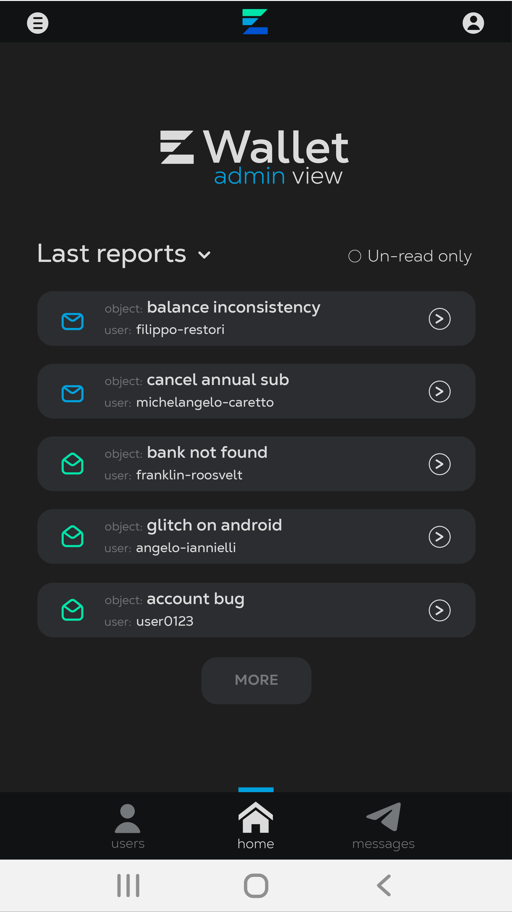

## SendMessage
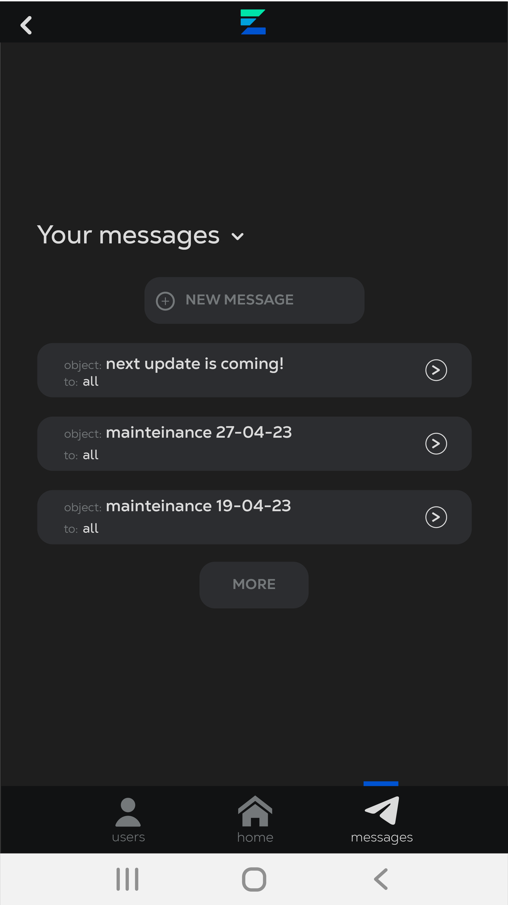

## NewMessage
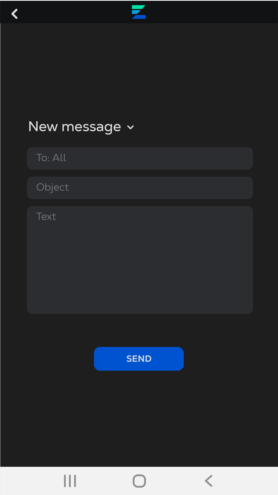

## UserLists
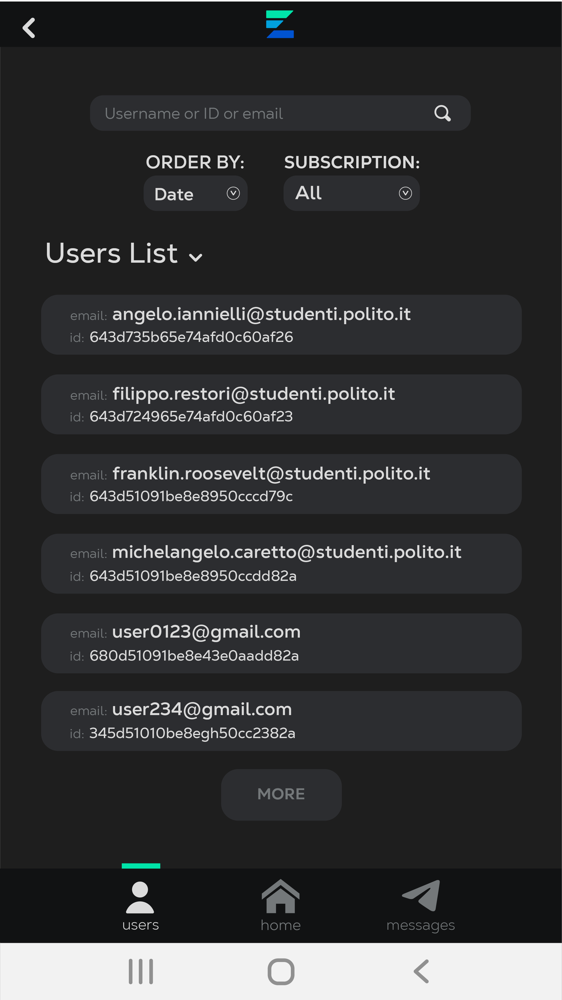

## GetUserDetails
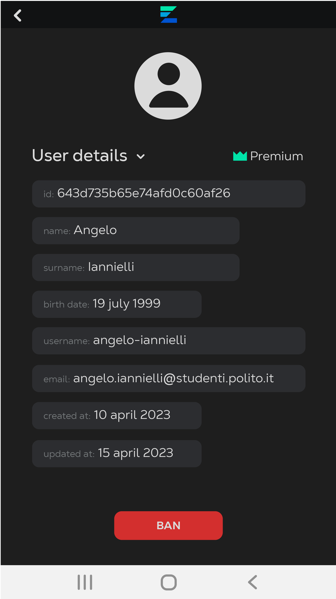

## Read/Edit report Thread
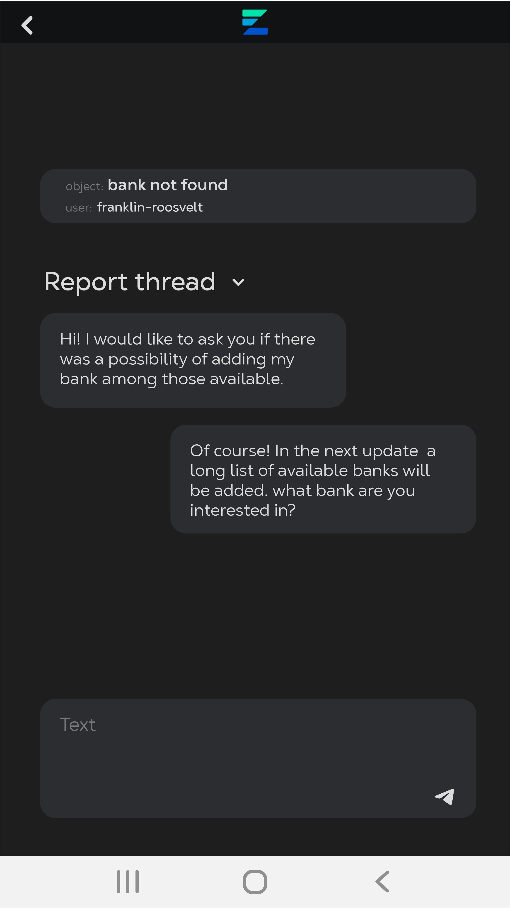

