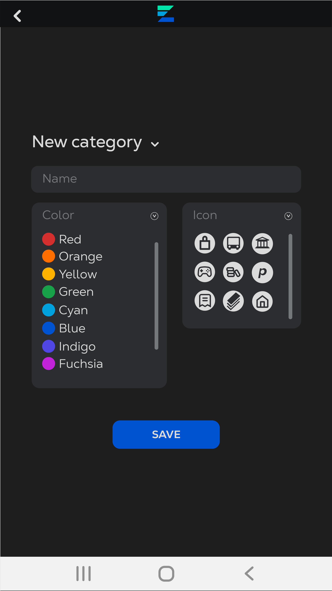
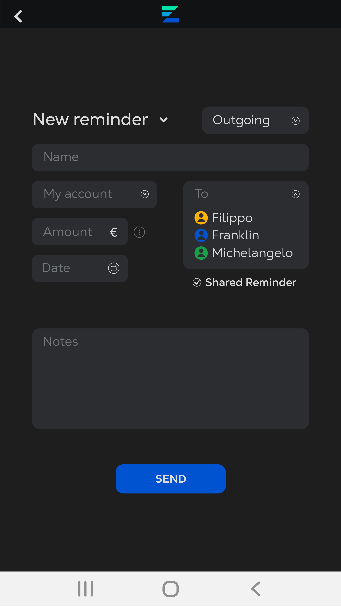

# Graphical User Interface Prototype  - FUTURE

Authors:Group14

Date: 27/04/2023

Version:v2
   

## Login

## Logout+Edit Profile

## Create Accounts

## Get Accounts List

## Get Transactions List

##  ViewStats

## Create Transaction

## Create Transaction

## Create Transaction

## Create Transaction (create category)

## Create Reminder

## Edit Transaction

## Set Budget/Language/Notification

## Contacts Management

## GetReports

## SendMessage

## NewMessage

## UserLists

## GetUserDetails

## Read/Edit report Thread

