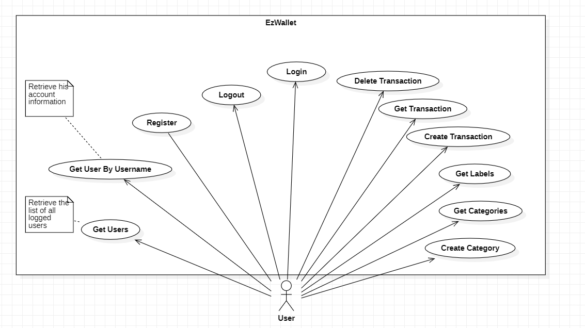
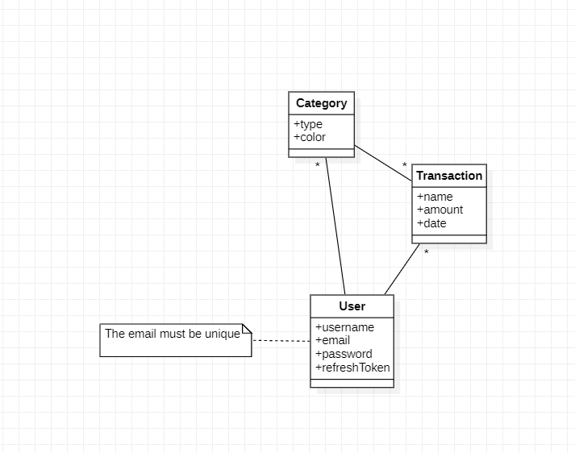
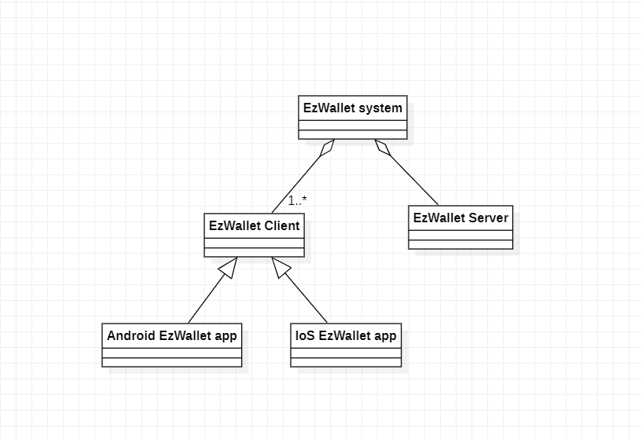
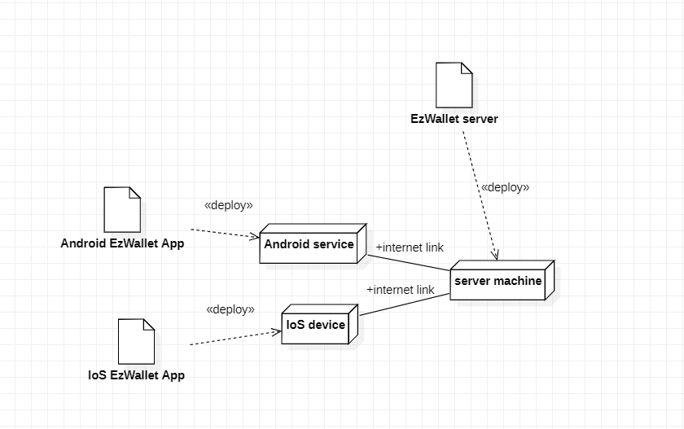

# Requirements Document - current EZWallet

Date: 19/04/2023

Version: V1 - description of EZWallet in CURRENT form (as received by teachers)

 
| Version number | Change |
| ----------------- |:-----------|
| 1.1 | | 


# Contents

- [Requirements Document - current EZWallet](#requirements-document---current-ezwallet)
- [Contents](#contents)
- [Informal description](#informal-description)
- [Stakeholders](#stakeholders)
- [Context Diagram and interfaces](#context-diagram-and-interfaces)
	- [Context Diagram](#context-diagram)
	- [Interfaces](#interfaces)
- [Stories and personas](#stories-and-personas)
- [Functional and non functional requirements](#functional-and-non-functional-requirements)
	- [Functional Requirements](#functional-requirements)
	- [Non Functional Requirements](#non-functional-requirements)
- [Use case diagram and use cases](#use-case-diagram-and-use-cases)
	- [Use case diagram](#use-case-diagram)
		- [Use case 1, LOGIN](#use-case-1-login)
				- [Scenario 1.1  (Nominal Scenario)](#scenario-11--nominal-scenario)
				- [Scenario 1.2  (Already Logged in)](#scenario-12--already-logged-in)
		- [Use case 2, REGISTER](#use-case-2-register)
				- [Scenario 2.1 (Nominal Scenario)](#scenario-21-nominal-scenario)
		- [Use case 3, LOGOUT](#use-case-3-logout)
				- [Scenario 3.1 (Nominal Scenario)](#scenario-31-nominal-scenario)
		- [Use case 4, CREATE TRANSACTION](#use-case-4-create-transaction)
				- [Scenario 4.1 (Nominal Scenario)](#scenario-41-nominal-scenario)
		- [Use case 5, DELETE TRANSACTION](#use-case-5-delete-transaction)
				- [Scenario 5.1  (Nominal Scenario)](#scenario-51--nominal-scenario)
		- [Use case 6, GET ALL TRANSACTIONS](#use-case-6-get-all-transaction)
				- [Scenario 6.1 (Nominal Scenario)](#scenario-61-nominal-scenario)
		- [Use case 7, CREATE CATEGORY](#use-case-7-create-category)
				- [Scenario 7.1  (Nominal Scenario)](#scenario-71--nominal-scenario)
		- [Use case 8, GET CATEGORIES](#use-case-8-get-categories)
				- [Scenario 8.1  (Nominal Scenario)](#scenario-81--nominal-scenario)
		- [Use case 9, GET LABELS](#use-case-9-get-labels)
				- [Scenario 9.1 (Nominal Scenario)](#scenario-91-nominal-scenario)
		- [Use case 10, GET USERS](#use-case-10-get-users)
				- [Scenario 10.1](#scenario-101)
		- [Use case 11, USERNAME](#use-case-11-username)
				- [Scenario 11.1 (Nominal Scenario)](#scenario-111-nominal-scenario)
- [Glossary](#glossary)
- [System Design](#system-design)
- [Deployment Diagram](#deployment-diagram)
- [Mistakes](#mistakes)

# Informal description
EZWallet (read EaSy Wallet) is a software application designed to help individuals and families keep track of their expenses. Users can enter and categorize their expenses, allowing them to quickly see where their money is going. EZWallet is a powerful tool for those looking to take control of their finances and make informed decisions about their spending.


# Stakeholders


| Stakeholder name  | Description | 
| ----------------- |:-----------:|
|User  |Individuals and Families who will use the delivarables in the daily life    | 
|App author	|Defines and develops the project.|
|Competitors	|Other app authors. |


# Context Diagram and interfaces

## Context Diagram


```plantuml
left to right direction
skinparam packageStyle rectangle
actor User
rectangle System {
	User -- (EZWallet)
	
}
```

## Interfaces


| Actor | Logical Interface | Physical Interface  |
| :-------------: |:-------------:| :-----:|
|  User      |Graphic User Interface (GUI) | Smartphone  |


# Stories and personas

| 	Persona	| Profiling | Story | 
|:----: |:-------------:| :-------------:|
|  	1 	| 	Student, Male ,24, low income	| wants to know all the transaction makes  for university   |
|  	2  	| 	Single, Male, 34 , low income	|wants to track all the transaction so that he can reduce useless expenses. |
|	3	|	Mother, married, 34 , high income| wants to record  the expenses done  |
|	4	|	Business Man,Single,High Income,No Children, 38 |	wants to categorize expenses so that he can make a correct financial decision.  |
|	5	|	Student ,female, 30, low income|	gets refunds by the market so  she  wants to delete transaction.|
|	6	|	Waitress  ,female, single with 2 children      |wants to separate and track the expenses of the two children. |


# Functional and non functional requirements

## Functional Requirements
| ID        | Description  |
| ------------- |:-------------:| 
|  FR1     |  Authenticate and authorize : The system shall  |
|	FR1.1 		| require that new user enter a username, email and password when registering to create a new user profile.|
|	FR1.2 		|require that user enter a password and username when logging in so that the system can authenticate his identity.|
|	FR1.3 		|allow the user to log out|
|  FR2     	|  Categories management : The systeme shall allow the user to |
|	FR2.1			|	 create category  by requesting a type and color.		|
|	FR2.2		|	access the list of categories.	|
| FR3  |  Transaction management : The systeme shall allow the user to| 
|	FR3.1 		|	create new transaction by requesting a type, amount and name.	|
|	FR3.2 		|	access the list of transactions.		|
|	FR3.3 		|	access all transactions with category label.	|
|	FR3.3 		|	delete a transaction.	|
|	FR4		|	The system shall allow the user to retrieve the list of all registered users.	|
|	FR5		|	The system shall allow the user to retrieve his personal information.|
|	FR6		|The system shall handling exceptions and display an error, success or informational message to inform the user about the status of a request.|

## Non Functional Requirements
| ID        | Type (efficiency, reliability, ..)           | Description  | Refers to |
| ------------- |:-------------:| :-----:| -----:|
|  NFR1     |Efficiency |The response time for all functions < 0,5 sec| all |
|  NFR2     |Reliability|  The service could be idle for a maximum of 1h/year| all |
|  NFR3     |Security|  The display of messages must be standardised and distinguishable from other outputs| FR6 |
|  NFR4     |Security| After logging in, every 1 hour, the system shall use an refresh token valid for 7 days to retrieve a new access token without requiring the user to perform an authentication each time when the access token has expired.| FR1 |
|  NFR5     |Usability | A user must be able to use all functionalities without any training in one day at most. |  all |
| NFR6 		|Privacy | All data of a user must only be accessible to that user.| all | 
| NFR7 		|Portability | The system shall run on IoS from version 9 and on android top 10 versions downloaded (https://gs.statcounter.com/os-version-market-share/android/mobile-tablet/worldwide) | all |


# Use case diagram and use cases


## Use case diagram



### Use case 1, LOGIN
| Actors Involved        | User |
| ------------- |:-------------:| 
|  Precondition     | The user is not already logged in and has a valid email and password |
|  Post condition     | The user is logged in and has access to their account |
|  Nominal Scenario     |  The system verifies the user's email and password, logs them in, and displays their account information |
|  Variants     |Already logged in |
|  Exceptions     | 1) If the user enters an invalid email or password, the system displays an error message and prompts the message <em>"wrong credentials"</em>. 2) If the user is not already registered in the database the system will display the message <em>"please you need to register</em>".  |

##### Scenario 1.1  (Nominal Scenario)
1. The user navigates to the login page and enters email and password.
2. The system validates the email.
3. The system compares the password given by the user to the crypted password in the database.
4.The request of login is successfully completed.

##### Scenario 1.2  (Already Logged in)
1. The user navigates to the login page and enters email and password.
2. The system found out that client is already logged in
3. The system prompts out ("you are already logged in") 
4. The request of login is successfully completed.


### Use case 2, REGISTER
| Actors Involved        | User |
| ------------- |:-------------:| 
|  Precondition     |  User is not registered |
|  Post condition     |  User account is successfully created in the database |
|  Nominal Scenario     |  The user enters their personal information, creates a username and password, and clicks the register button |
|  Variants     | No variants |
|  Exceptions     | If the user's email is already registered in the database the system will display the error message <em>"you are already registered"</em>.|

##### Scenario 2.1 (Nominal Scenario)
1. User starts the register request.
2. Users inserts email,username,password.
2. The system checks if the email is not already associated with an account.
3. The password is crypted  , then an account is created and stored in the database with name, email and password.
4. Return in the prompt "user added succesfully".
5. The request of register is successfully completed.


### Use case 3, LOGOUT
| Actors Involved        | User |
| ------------- |:-------------:| 
|  Precondition     | The user is already authenticated |
|  Post condition     | The user is logged out and cannot access their account until they log in again |
|  Nominal Scenario     |  The system logs the user out and displays a confirmation message |
|  Variants     |No variants |
|  Exceptions     | If the user attempts to logout, but he has already logged out previously, or if he never loggin in the first place,system will display an error message.|

##### Scenario 3.1 (Nominal Scenario)
1. The user starts the logout request
2. The system  verifies if the user exists.
3. The system logout the user.
4. The logout request is successfully completed.


### Use case 4, CREATE TRANSACTION 
| Actors Involved        | User |
| ------------- |:-------------:| 
|  Precondition     | User is authenticated and authorized to perform transactions |
|  Post condition     | Transaction is successfully created in the database |
|  Nominal Scenario     |  Create a new transaction with the given name, amount, and type, and save it to the database |
|  Variants     |  No Variants |
|  Exceptions     |  If the user's permission are not valid,  or are expired ,the system will display the error message  |

##### Scenario 4.1 (Nominal Scenario)
1. User  starts  a "create a transaction" request.
2. The system checks if the user is authorized.
3. System asks for transaction details (amount, type, name).
4. User enters transaction details.
5. System validates the transaction details and saves the transaction to the database.The transaction is saved with a unique ID.
6. System returns the transaction details.

### Use case 5, DELETE TRANSACTION 
| Actors Involved        | User |
| ------------- |:-------------:| 
|  Precondition     | User is authenticated and authorized to perform transactions |
|  Post condition     | Transaction is successfully  deleted in the database |
|  Nominal Scenario     |  Delete a transaction based on the transaction ID from the database |
|  Variants     |  No Variants|
|  Exceptions     |  If the user's permission are not valid,  or are expired ,the system will display the error message|

##### Scenario 5.1  (Nominal Scenario)
1. User asks  for  deleting a specific transaction.
2. The system checks if the user is authorized .
3. The transaction is successfully deleted.

### Use case 6, GET ALL TRANSACTION 
| Actors Involved        | User |
| ------------- |:-------------:| 
|  Precondition     | User is authenticated and authorized to perform transactions. The system has existing transactions stored in the database |
|  Post condition     | Transactions are successfully retrieved from the database |
|  Nominal Scenario     |  Get all the transaction for a specific user |
|  Variants     |  No Variants|
|  Exceptions     | If the user's permission are not valid,  or are expired ,the system will display the error message  |

##### Scenario 6.1 (Nominal Scenario)
1. User asks for the list of his transaction.
2. The system checks if the user is authorized .
3. The server retrieves all transactions from the database.
4. The server returns the list of transactions to the user.
5. The user receives the list of transactions.


### Use case 7, CREATE CATEGORY 
| Actors Involved        | User |
| ------------- |:-------------:| 
|  Precondition     | User is authenticated and authorized. |
|  Post condition     | Category is successfully created in the database |
|  Nominal Scenario     |  The system saves the new category with type and color |
|  Variants     | No Variants|
|  Exceptions   |   If the user's permission are not valid,  or are expired ,the system will display the error message |
##### Scenario 7.1  (Nominal Scenario)
1. User wants to create a category.
2. System asks the category's details.
2. User enters the type and color for the new category.
3. The server create the new category with the color and type given by the user.
4. The server saves the new category in the database.

### Use case 8, GET CATEGORIES 
| Actors Involved        | User |
| ------------- |:-------------:| 
|  Precondition     | User is authenticated and authorized. |
|  Post condition     | All categories are successfully retrieved from the database |
|  Nominal Scenario     |  The system display all the categories saved in the database |
|  Variants     | No Variants|
|  Exceptions     |  If the user's permission are not valid,  or are expired ,the system will display the error message  |
##### Scenario 8.1  (Nominal Scenario)
1. The user asks for the list of categories.
2. The system checks if the user is authorized .
3. The server retrieves all categories from the database.
4. The server returns the list of categories to the user.
5. The user receives the list of categories.

### Use case 9, GET LABELS
| Actors Involved        | User |
| ------------- |:-------------:| 
|  Precondition     | User is authenticated and authorized |
|  Post condition     | Labels are successfully retrieved from the database |
|  Nominal Scenario     |  Users can retrieve a list of all available labels that can be used to categorize their transactions |
|  Variants     |None |
|  Exceptions     | If the user's permission are not valid,  or are expired ,the system will display the error message |

##### Scenario 9.1 (Nominal Scenario)
1. User asks for the list of  all transactions with an added color according to the type of category.  
2. The system checks if the user is authorized .
3. System retrieves the data and sends to the user.
3. The user receive the list.

### Use case 10, GET USERS
| Actors Involved        | User |
| ------------- |:-------------:| 
|  Precondition     | User is logged in.  |
|  Post condition     | The user can view a list of all users in the system|
|  Nominal Scenario     |  The user asks for the list of logged users, and the system  displays a list of all logged users's  account informations. |
|  Variants     | |
|  Exceptions     | If the system encounters an error while trying to display the list of users, the system will give an error message |

##### Scenario 10.1
1. The user asks for the list of logged users.
2. The system displays a list of all logged users.

### Use case 11, USERNAME
| Actors Involved  | User |
| ------------- |:-------------:| 
|  Precondition     | User is logged in.  |
|  Post condition     | User information is retrieved from the database and displayed.|
|  Nominal Scenario     |  The system verifies the user's email and password, logs them in, and displays their account information |
|  Variants     |If the provided username parameter is invalid, the server responds with an error message |
|  Exceptions     | 1.If the user's permission are not valid,  or are expired ,the system will display the error message. 2. If the user to find out  does not exist the system will display an error message  |

#####  Scenario 11.1 (Nominal Scenario)
Precondition: User is logged in
Postcondition: User information is retrieved from the database and displayed.
1. The user asks for his account details.
2. The system checks if the user is authorized .
4. The server retrieves the user information from the database.
5. The server sends the user information back to the client.
6. The client displays his account details.

# Glossary
 


# System Design


# Deployment Diagram 



