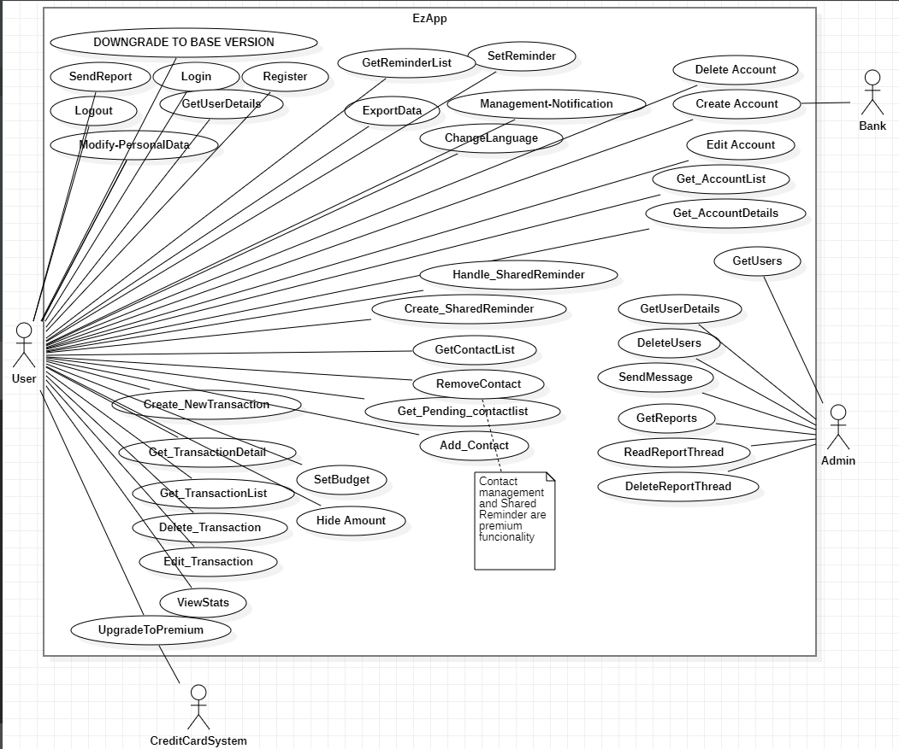
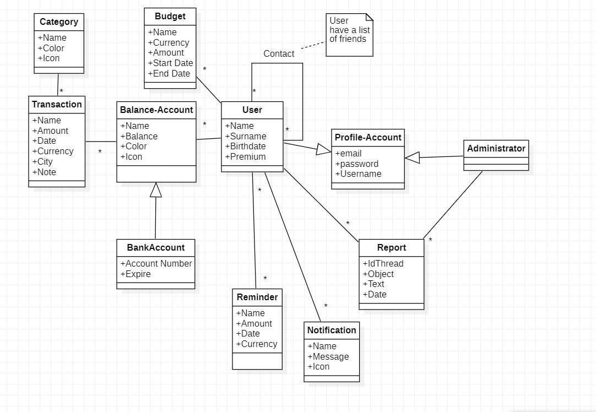
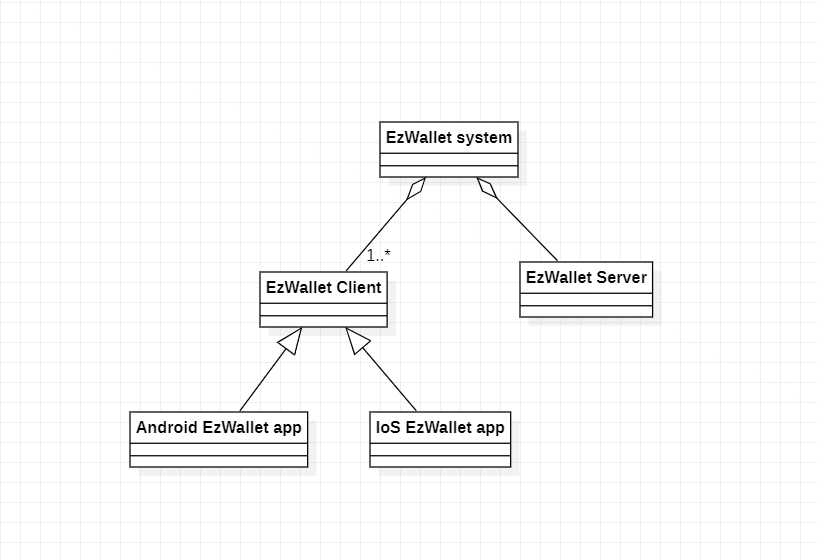

# Requirements Document - future EZWallet

Date: 25/04/2023

Version: V2 - description of EZWallet in FUTURE form (as proposed by the team)

 
| Version number | Change |
| ----------------- |:-----------|
| 2.1| | 


# Contents

- [Requirements Document - future EZWallet](#requirements-document---future-ezwallet)
- [Contents](#contents)
- [Informal description](#informal-description)
- [Stakeholders](#stakeholders)
- [Context Diagram and interfaces](#context-diagram-and-interfaces)
	- [Context Diagram](#context-diagram)
	- [Interfaces](#interfaces)
- [Stories and personas](#stories-and-personas)
- [Functional and non functional requirements](#functional-and-non-functional-requirements)
	- [Functional Requirements](#functional-requirements)
	- [Non Functional Requirements](#non-functional-requirements)
- [Use case diagram and use cases](#use-case-diagram-and-use-cases)
	- [Use case diagram](#use-case-diagram)
		- [Use case 1, REGISTRATION](#use-case-1-registration)
				- [Scenario 1.1 (Nominal Scenario)](#scenario-11-nominal-scenario)
		- [Use case 2, LOGIN](#use-case-2-login)
				- [Scenario 2.1 (Nominal Scenario)](#scenario-21-nominal-scenario)
				- [Scenario 2.2](#scenario-22)
		- [Use case 3, LOGOUT](#use-case-3-logout)
				- [Scenario 3.1 (Nominal Scenario)](#scenario-31-nominal-scenario)
		- [Use case 4, MODIFY PERSONAL DATA](#use-case-4-modify-personal-data)
				- [Scenario 4.1 (Nominal Scenario)](#scenario-41-nominal-scenario)
				- [Scenario 4.2](#scenario-42)
		- [Use case 5, GET ACCOUNTS LIST](#use-case-5-get-accounts-list)
				- [Scenario 5.1 (Nominal Scenario)](#scenario-51-nominal-scenario)
		- [Use case 6, GET ACCOUNT DETAILS](#use-case-6-get-account-details)
				- [Scenario 6.1 (Nominal Scenario)](#scenario-61-nominal-scenario)
		- [Use case 7, CREATE ACCOUNT](#use-case-7-create-account)
				- [Scenario 7.1 (Nominal Scenario)](#scenario-71-nominal-scenario)
		- [Use case 8, EDIT ACCOUNT](#use-case-9-edit-account)
				- [Scenario 8.1 (Nominal Scenario)](#scenario-81-nominal-scenario)
				- [Scenario 8.2](#scenario-82)
		- [Use case 9, DELETE ACCOUNT](#use-case-9-delete-account)
				- [Scenario 9.1](#scenario-91)
		- [Use case 10, GET TRANSACTIONS LIST](#use-case-10-get-transactions-list)
				- [Scenario 10.1 (Nominal Scenario)](#scenario-101-nominal-scenario)
				- [Scenario 10.2](#scenario-102)
				- [Scenario 10.3](#scenario-103)
				- [Scenario 10.4](#scenario-104)
		- [Use case 11, GET TRANSACTION DETAILS](#use-case-11-get-transaction-details)
				- [Scenario 11.1 (Nominal Scenario)](#scenario-111-nominal-scenario)
		- [Use case 12, CREATE NEW TRANSACTION](#use-case-12-create-new-transaction)
				- [Scenario 12.1 (Nominal Scenario)](#scenario-121-nominal-scenario)
				- [Scenario 12.2](#scenario-122)
				- [Scenario 12.3](#scenario-123)
				- [Scenario 12.4](#scenario-124)
				- [Scenario 12.5](#scenario-125)
		- [Use case 13, EDIT TRANSACTION](#use-case-13-edit-transaction)
				- [Scenario 13.1 (Nominal Scenario)](#scenario-131-nominal-scenario)
		- [Use case 14, DELETE TRANSACTION](#use-case-14-delete-transaction)
		- [Use case 15, VIEW STATS](#use-case-15-view-stats-basic-user)
				- [Scenario 15.1 (Nominal Scenario)](#scenario-151-nominal-scenario)
				- [Scenario 15.2](#scenario-152)
		- [Use case 16, SET BUDGET](#use-case-16-set-budget)
				- [Scenario 18.1 (Nominal Scenario)](#scenario-161-nominal-scenario)
		- [Use case 17, SET REMINDER](#use-case-17-set-reminder)
				- [Scenario 17.1 (Nominal Scenario)](#scenario-171-nominal-scenario)
		- [Use case 18, GET CONTACTS LIST](#use-case-18-get-contacts-list)
				- [Scenario 18.1 (Nominal Scenario)](#scenario-181-nominal-scenario)
		- [Use case 19, GET USER DETAILS (User)](#use-case-19-get-user-details-user)
				- [Scenario 19.1 (Nominal Scenario)](#scenario-191-nominal-scenario)
				- [Scenario 19.2](#scenario-192)
		- [Use case 20, GET PENDING CONTACTS LIST](#use-case-20-get-pending-contacts-list)
				- [Scenario 20.1 (Nominal Scenario)](#scenario-201-nominal-scenario)
		- [Use case 21, ADD CONTACT TO CONTACTS LIST](#use-case-21-add-contact-to-contacts-list)
				- [Scenario 21.1 (Nominal Scenario)](#scenario-211-nominal-scenario)
				- [Scenario 21.2](#scenario-212)
		- [Use case 22, REMOVE CONTACT](#use-case-22-remove-contact)
				- [Scenario 22.1 (Nominal Scenario)](#scenario-221-nominal-scenario)
		- [Use case 23, GET REMINDERS LIST](#use-case-23-get-reminders-list)
				- [Scenario 23.1 (Nominal Scenario)](#scenario-231-nominal-scenario)
		- [Use case 24, CREATE A SHARED REMINDER](#use-case-24-create-a-shared-reminder)
				- [Scenario 24.1 (Nominal Scenario)](#scenario-241-nominal-scenario)
		- [Use case 25, HANDLE SHARED REMINDER](#use-case-25-handle-shared-reminder)
				- [Scenario 25.1 (Nominal Scenario)](#scenario-251-nominal-scenario)
		- [Use case 26, SEND REPORT](#use-case-26-send-report)
				- [Scenario 26.1 (Nominal Scenario)](#scenario-261-nominal-scenario)
				- [Scenario 26.2](#scenario-262)
		- [Use case 27, UPGRADE TO PREMIUM](#use-case-27-upgrade-to-premium)
				- [Scenario 27.1 (Nominal Scenario)](#scenario-271-nominal-scenario)
		- [Use case 28, DOWNGRADE TO BASE VERSION](#use-case-28-downgrade-to-base-version)
				- [Scenario 28.1](#scenario-281)
		- [Use case 29, EXPORT DATA](#use-case-29-export-data)
				- [Scenario 29.1](#scenario-291)
		- [Use case 30, MANAGE NOTIFICAIONS](#use-case-30-manage-notifications)
				- [Scenario 30.1](#scenario-301)
		- [Use case 31, HIDE AMOUNTS/BALANCES](#use-case-31-hide-amountsbalances)
				- [Scenario 31.1 (Nominal Scenario)](#scenario-311-nominal-scenario)
		- [Use case 32, CHANGE LANGUAGE](#use-case-32-change-language)
				- [Scenario 32.1 (Nominal Scenario)](#scenario-321-nominal-scenario)
		- [Use case 33, GET USERS](#use-case-33-get-users)
				- [Scenario 33.1 (Nominal Scenario)](#scenario-331-nominal-scenario)
				- [Scenario 33.2](#scenario-332)
				- [Scenario 33.3](#scenario-333)
		- [Use case 34, GET USER DETAILS (Admin)](#use-case-34-get-user-details-admin)
				- [Scenario 34.1 (Nominal Scenario)](#scenario-341-nominal-scenario)
				- [Scenario 34.2](#scenario-342)
		- [Use case 35, DELETE USERS](#use-case-35-delete-users)
				- [Scenario 35.1 (Nominal Scenario)](#scenario-351-nominal-scenario)
		- [Use case 36, SEND MESSAGE](#use-case-36-send-message)
				- [Scenario 36.1 (Nominal Scenario)](#scenario-361-nominal-scenario)
				- [Scenario 36.2](#scenario-382)
		- [Use case 37, GET REPORTS](#use-case-37-get-reports)
				- [Scenario 37.1 (Nominal Scenario)](#scenario-371-nominal-scenario)
				- [Scenario 37.2](#scenario-372)
		- [Use case 38, READ REPORT THREAD](#use-case-38-read-report-thread)
				- [Scenario 38.1 (Nominal Scenario)](#scenario-381-nominal-scenario)
				- [Scenario 38.2](#scenario-382)
		- [Use case 39, DELETE REPORT THREAD](#use-case-39-delete-report-thread)
				- [Scenario 39.1 (Nominal Scenario)](#scenario-39-nominal-scenario)
				- [Scenario 39.2](#scenario-392)
- [Glossary](#glossary)
- [System Design](#system-design)
- [Deployment Diagram](#deployment-diagram)

# Informal description
EZWallet (read EaSy Wallet) is a software application designed to help individuals and families keep track of their expenses. Users can enter and categorize their expenses, allowing them to quickly see where their money is going. EZWallet is a powerful tool for those looking to take control of their finances and make informed decisions about their spending.


# Stakeholders


| Stakeholder name  | Description | 
| ----------------- |:-----------:|
|User  |Individuals and Families who will use the delivarables in the daily life    | 
|App Owner	|Involved in project definition, buys and approuves the software and provides the service.|
|Administrator	|Installs, updates, tunes, diagnoses and monitors both internal and third-party application. Views and manages users  privileges and permissions.|
|Performing Organisation | Leads the project activities and develops the software.|
|Competitors		|Other Business Owners. |		
|Google Play / Apple Play	|Online stores where people will go to find the app.	|
| Credit Card System |  Manages payments   |
| Banks | Enables grant access to the account details using open banking API |
 

# Context Diagram and interfaces

## Context Diagram


```plantuml
left to right direction
skinparam packageStyle rectangle
actor User
actor Bank
actor "Credit Card System"
actor Administrator
rectangle System {
 User -- (EZWallet)
 Administrator -- (EZWallet)
 (EZWallet) -- Bank
 (EZWallet) -- "Credit Card System"
}
```
## Interfaces


| Actor | Logical Interface | Physical Interface  |
| :-------------: |:-------------:| :-----:|
|  User      |Graphic User Interface (GUI) | Smartphone  |
| Administrator| Graphic User Interface (GUI)  | SmartPhone |
| Credit Card System | API |Internet connection|
| Bank | API |Internet connection|

# Stories and personas


| 	Persona	| Profiling | Story | 
|:----: |:-------------:| :-------------:|
|  	1 	| 	Student, Male ,24, low income	| is conducting a review of his annual expenditure and needs to know about all transactions made for the university |
|  	2  	| 	Single, Male, 34 , low income	|became a new father and wants to keep track of all his transactions in order to reduce unnecessary expenses and increase his child's ration. |
|	3	|	Mother, married, 34 , high income| has memory problems and wants to set up reminders for her transactions and record expenses.  |
|	4	|	Business Man, Single, High Income, No Children, 38 |	wants to have multiple balance accounts in one place and categorise transactions so they can make correct financial decisions. |
|	5	|	Student , female, 30, low income|makes a transaction by mistake and wants to delete it|
|	6	|	Waitress , female, single with 2 children  |wants to monitor and analise her expenses of both children separately to avoid to go into debt at the end of the month.|
|  7  |  Worker , male, medium income, sigle  |wants to set a budget for his upcoming vacation in July |
|  8  |  Student  , male, 22, low income      |invites friends to go out every weekend and wants a tools to share expenses with them. |
| 9 | Woman, no children, recently retired after a long career as teacher| spent a lot and now wants to analyse her expenses and reduce them. |


# Functional and non functional requirements

## Functional Requirements
| ID        | Description  |
| ------------- |:-------------:| 
|  FR1     | The system shall manage Authentications and Authorisations |
|	FR1.01 		| The system shall require that the new user enters firstname, lastname, date of birth, username, e-mail and password when registering to create a new user profile.|
|	FR1.02 		|The user shall be able to read and update his personal profile information.|
|	FR1.03 		|The user shall be able to delete his profile account.|
|FR1.04 | The user shall be able to insert a profile image (photo).|
|FR1.05 | The system shall require that user enter a password and username when logging in so that the system can authenticate his identity.|
|FR1.06 | The system shall allow the user to log out from the profile.|
|FR1.07 | The user shall be able to update the subcription from free to premium access and unsuscribe.|
|  FR2     	|  The system shall manage balance accounts and their transactions|
|	FR2.01			|	 The system shall provide the user with a set of customised financial source (name, color and icon) that the user can use to create an balance private account, or to create an balance account syncronized to an external bank account.|
|	FR2.02		|	The user shall be able to read, update or delete a balance account. |
|	FR2.03		|	The system shall allow the user to access the list of balance accounts.|
|	FR2.04		|	The user shall be able to create new transaction by providing the system with name, amount, date, category type, city, note, balance account name and currency.|
|	FR2.05		|	The system shall allow the user to access the list of transactions.|
|	FR2.06		|	The systeme shall allow the user to read, update and to delete a transaction and related details.|
| FR2.07 |  The user shall be able to filter or search a categoty or transaction by date, amount or name.| 
|	FR2.08 		|	The sytem shall provide the user with a set of categories to use.|
|	FR2.09		|	The user shall be able to create new category by providing the system with type, color and icon.		|
|	FR2.10		|	The systeme shall allow the user read, update and to delete a category	|
|	FR2.11 		|	The system shall allow the user to access the list of categories.	|
|	FR2.12		|	The system shall display graphs with general statistics for all accounts (distribution, expenditure by category, income/expenditure trend, balance forecast based on available data, monthly average of expenditure by category, comparison of current expenditure by category with the last month/average).|
|	FR2.13		|	The user must be able to view the graphs according to the account name.|
|	FR2.14		|The user shall be able to set up a budget.|
|	FR2.15		|The user must be able to set a personal reminder. |
|	FR3		|The system shall manage friendships|
|	FR3.01		|The user must be able to make friendship requests in order to create an information exchange network.|
|	FR3.02		|The user shall be able to accept or reject incoming friend requests.|
|	FR3.03		|The user must be able to set a reminder  (with name, date, digit, type, notification date, notes) and send it to a friend who can accept or reject it.|
|	FR3.04		|The user must be able to access the list of friends.|
|	FR3.05		|The user must be able to access the list of all reminder sent or received.|
|	FR3.06		|The system must notify the user of the status of all reminder sent or received.|
|	FR3.07		|The user must be able to read, update or delete a reminder.|
|	FR3.08		|The user shall be able to remove a friendship.|
|FR4|The system shall allow the administrator to manage users and wallet|
|	FR4.01		|The system shall allow the administrator to retrieve a single user or the list of all registered users with their profile information.|
|	FR4.02		|The administrator must be able to change user information on request.|
|	FR4.03		|The administrator shall be able to open, respond or delete reports.|
|	FR05		|The user shall be able to open a report (ticket to inform about a bug or issues) and reply to it.|
|	FR06		|The user must be able to export analytical data.|
|	FR07		|The user shall be able to manage notification setting.|
|	FR08		|The system shall allow the user to hide the displayed balances.|
|	FR09		|The system shall handling exceptions and display an error, success or informational message to inform the user about the status of a request.|
| FR10 | The user shall be able to change the wallet language.|
|	FR11	|The system shall manage access rights and profile privileges.|


## Non Functional Requirements

| ID        | Type (efficiency, reliability, ..)           | Description  | Refers to |
| ------------- |:-------------:| :-----:| -----:|
|  NFR1     |Efficiency |The response time for all functions < 0,5 sec| all |
|  NFR2     |Reliability|  The service could be idle for a maximum of 1h/year| all |
|  NFR3    |Reliability|  The bank syncronization shall be done at most every minute| all |
|  NFR4     |Security|  The display of messages must be standardised and distinguishable from other outputs| FR6 |
|  NFR5     |Security| After logging in, every 1 hour, the system shall use an refresh token valid for 7 days to retrieve a new access token without requiring the user to perform an authentication each time when the access token has expired.| FR1 |
|NFR6 |Security | The system must hide the typed password and ensure the password complexity by checking if there are at least 1 numeric, one uppercase, one lowercase and one special character.|
|  NFR7     |Usability | A user must be able to use all functionalities without any training in one day at most. |  all |
| NFR8		|Privacy | All personal data and reports of a user must be accessible only to that user and the administrator.| all | 
| NFR9		|Portability | The system shall run on IoS from version 9 and on android top 10 versions downloaded (https://gs.statcounter.com/os-version-market-share/android/mobile-tablet/worldwide) | all |
|


# Use case diagram and use cases


## Use case diagram



### Use case 1, REGISTRATION

| Actors Involved        | User |
| ------------- |:-------------| 
|  Precondition     | None|
|  Post condition     | User is now registered |
|  Nominal Scenario     | 1. User provides their information to be signed up |
|  Variants     | None |
|  Exceptions     |<ol start="2"> <li> User is already registered: <br> System informs user and proposes to log in <li> Username is not available: <br> System requests to try with an other username |

##### Scenario 1.1 (Nominal Scenario)

1. User asks to sign up.
2. System requests an username (unique), an email (not already registered), name, surname, date of birth, password.
3. User enters all required information.
4. System verifies the validity of the information.
5. System registers the new user.
6. System proposes the user to log in.


### Use case 2, LOGIN

| Actors Involved        | User |
| ------------- |:-------------| 
|  Precondition     | The user is not already logged in|
|  Post condition     | The user is logged in and has access to their account |
|  Nominal Scenario     | 1. The system verifies the user's email/username and password, logs them in, and displays their wallet |
|  Variants     | <ol start="2"> <li> User is not registered, so they sign up <li> User has forgotten credentials|
|  Exceptions     | <ol start="4"> <li> If credentials are wrong, the system doesn't authorize user to log in|

##### Scenario 2.1 (Nominal Scenario)

1. User asks the system to log in.
2. System requests email or username and password.
3. User enters email/username and password.
4. System verifies the credentials.
5. System authorizes the user to access.

##### Scenario 2.2
1. User asks the system to log in.
2. System requests email or username and password.
3. User asks to recover credentials.
4. System sends an email to the user with the link to access and change password
5. User uses the link to access to the system.
6. User changes the password. 
7. User asks again to log in.
8. System asks credential.
9. User enters email/username and the new password.
10. System verifies the credentials.
11. System authorizes the user to access.

### Use case 3, LOGOUT

| Actors Involved        | User |
| ------------- |:-------------| 
|  Precondition     | User is logged in and authorized|
|  Post condition     | The user is logged out and cannot access their account until they log in again |
|  Nominal Scenario     | 1. The user asks the system to log out |
|  Variants     | None |
|  Exceptions     |<ol start="2"> <li> If the session is expired, the system displays a message to inform user that they are already logged out|

##### Scenario 3.1 (Nominal Scenario)

1. User asks to log out.
2. System disables access permissions to the user.
3. User is logged out.

### Use case 4, MODIFY PERSONAL DATA

| Actors Involved        | User |
| ------------- |:-------------| 
|  Precondition     | User is logged in and authorized|
|  Post condition     | User personal details are updated |
|  Nominal Scenario     | 1. User edits their personal data and the system saves all changes|
|  Variants     | <ol start="2"> <li> User enters a new profile picture|
|  Exceptions     |<ol start="3"> <li> If the user enters an unavailable username or an email used by others, the system displays an error message <br> *Postcondition:* Changes are not saved|

##### Scenario 4.1 (Nominal Scenario)

1. User asks to edit their personal details.
2. System asks for the new data.
3. User enters the new information.
4. System verifies the validity of new data.
5. System replaces the old data with the new.
6. System shows user personal details correctly updated.

##### Scenario 4.2
1. User asks to insert a new picture for their profile.
2. System asks the file.
3. User uploads the image.
4. System adapts the image to the size required if it's needed.
5. System memorizes the picture.
6. System displays the profile details updated.

### Use case 5, GET ACCOUNTS LIST 

| Actors Involved        | User |
| ------------- |:-------------| 
|  Precondition     | User is logged in and authorized |
|  Post condition     | None |
|  Nominal Scenario     | User gets the list of their accounts |
|  Variants     | None |
|  Exceptions     |<ol start="2"> If the list is empty, the system informs the user that the list is blank|

##### Scenario 5.1 (Nominal Scenario)

1. User asks for accounts list.
2. System retrieves data.
3. System displays the list.

### Use case 6, GET ACCOUNT DETAILS

| Actors Involved        | User |
| ------------- |:-------------| 
|  Precondition     | User is logged in and authorized |
|  Post condition     | None |
|  Nominal Scenario     | 1. User asks to read all the details of a particular account from the list|
|  Variants     | None |
|  Exceptions     |None|

##### Scenario 6.1 (Nominal Scenario)
1. User selects an account from the list.
2. The system displays all details to the user.

### Use case 7, CREATE ACCOUNT

| Actors Involved        |  User |
| ------------- |:-------------| 
|  Precondition     | User is logged in and authorized|
|  Post condition     | A new account is created |
|  Nominal Scenario     | 1. User enters the information about a new account and the system memorizes it |
|  Variants     | <ol start="2"> <li> Premium user version <li> Premium user link bank account   |
|  Exceptions     | <ol start="4"><li> If the user is a basic user and they want to link the new account to an existing bank account, the system proposes to make a subscription to the premium version of the app <li> If user has already 3 account, the system proposes to make a subscription to the premium version of the app <li> Bank system doesn't authorize the system to access data <br> *Postcondition:* System requests to try later again |

##### Scenario 7.1 (Nominal Scenario)

1. User asks to create a new account.
2. System verifies the user has less than 3 accounts.
3. System asks for name, starting balance, color, icon and value.
4. User inserts all required information.
5. System creates the new account.
6. System displays the list of accounts updated.


##### Scenario 7.2 (Premium User Version)
1. User asks to create a new account.
2. System asks for name, starting balance, color, icon and value.
3. User inserts all required information.
4. System creates the new account.
5. System displays the list of accounts updated.

##### Scenario 7.3 (Premium user link bank account)
1. User asks to create a new account.
2. System asks for name, starting balance, color, icon and currency.
3. User enters name, color and icon.
4. User asks to connect it to an existing bank account.
5. System requests to select the bank from a list of available banks.
6. User selects their bank.
7. System requests explicitly the permission to access sensitive data.
8. User responds positively.
9. System redirects the user to the official bank website.
10. System receives authorization from the bank.
11. System retrieves data.
12. System verifies it has all required information.
13. System creates a new account linked to the bank one.
14. System displays the updated list of accounts.


### Use case 8, EDIT ACCOUNT

| Actors Involved        | User |
| ------------- |:-------------| 
|  Precondition     | User is logged in and authorized|
|  Post condition     | Account information is updated |
|  Nominal Scenario     | 1. User modifies their account information |
|  Variants     | <ol start="2"> <li> User asks to edit the balance|
|  Exceptions     |None|

##### Scenario 8.1 (Nominal Scenario)

1. User asks to edit account details.
2. System asks for the new data.
3. User enters the new name and/or color and/or icon.
4. System saves the new information.
5. System shows the updated list of accounts.

##### Scenario 8.2
1. User asks to edit account details.
2. System asks for the new data.
3. User asks to edit the current balance.
4. System asks if the user wants to introduce a discontinuity in the balance or a new transaction to fix it.
5. User answers the question.
6. System creates a new transaction if it is necessary.
7. System saves the new information.
8. System shows the updated list of accounts.

### Use case 9, DELETE ACCOUNT

| Actors Involved        | User |
| ------------- |-------------| 
|  Precondition     | User is logged in and authorized|
|  Post condition     | An account and its transactions are deleted and the balance is recalculated |
|  Nominal Scenario     | 1. User selects an account and asks to delete it |
|  Variants     | None |
|  Exceptions     |2. User doesn't confirm the changes <br> *Postcondition:* The account is not deleted|

##### Scenario 9.1

1. User selects the account they want to delete.
2. User asks to delete it.
3. System requests confirmation to delete it and its transactions.
4. User responds positively.
5. System deletes the account and all transaction that are related.
6. System updates the general balance.
7. System shows the list of accounts refreshed.

### Use case 10, GET TRANSACTIONS LIST

| Actors Involved        | User |
| ------------- |:-------------| 
|  Precondition     | User is logged in and authorized|
|  Post condition     | The transactions list is displayed to the user |
|  Nominal Scenario     | 1. User asks for the complete list of transactions |
|  Variants     | <ol start="2"> <li> User selects some filters <li> User selects a way to order the transactions <li> User asks for transaction with a particular name|
|  Exceptions     |<ol start="5"> <li> If the general list is empty, the system proposes the user to create their first transaction <li> If the result of the filtered search is empty, the system notifies that the search has produced a blank list |

##### Scenario 10.1 (Nominal Scenario)

1. User asks for the list of all transactions.
2. System retrieves the list.
3. System displays the transactions to the user.

##### Scenario 10.2
1. User asks for the list of transactions filtered by a specific category/date and by the type (outgoings, revenues, tranfers).
2. System retrieves the list.
3. System displays the transactions to the user.

##### Scenario 10.3
1. User asks for the list of all transactions, ordered by date/amount.
2. System retrieves the list.
3. System displays the transactions to the user.

##### Scenario 10.4
1. User asks for the list of transactions that have a specific name.
2. System retrieves the list.
3. System displays the transactions to the user.

### Use case 11, GET TRANSACTION DETAILS

| Actors Involved        | User |
| ------------- |:-------------| 
|  Precondition     | User is logged in and authorized |
|  Post condition     | None |
|  Nominal Scenario     | 1. User asks to read all the details of a particular transaction from the list|
|  Variants     | None |
|  Exceptions     |None|

##### Scenario 11.1 (Nominal Scenario)
1. User selects a transaction from the list.
2. The system displays all details to the user.

### Use case 12, CREATE NEW TRANSACTION

| Actors Involved        | User |
| :------------- |:-------------| 
|  Precondition     | User is logged in and authorized|
|  Post condition     | A new transaction is stored in the system |
|  Nominal Scenario     | 1. Users inserts the details of a new transaction and system saves and adds it to the transactions list (outgoing transaction by default)|
|  Variants     | <ol start="2"> <li> User doesn't add an outgoing transaction, instead he wants to memorize an incoming transaction <li> User adds a transfer (from one of their accounts to another of their accounts) <li> User creates a new category while he is entering the details <li> User uses a different currence from the default currence of the account|
|  Exceptions     |<ol start="6"> <li> User loses connection or starts another activity <br> *Postcondition:* the transaction is not stored in the system <li> User doesn't enter all information required <br> *Postcondition:* the transaction is blocked and the system asks for the missing details |

##### Scenario 12.1 (Nominal Scenario)

1. User asks for adding a new transaction.
2. System asks for name, amount, date, category, currency of the transaction, the used account, the city where he paid, the receiver (from contacts list or not) of the money and some notes. City, receiver and notes are optional.
3. User inserts all required information.
4. System verifies nothing is missing.
5. System memorizes the new transaction.
6. System updates the general balance and the account balance.
7. System shows the list of transactions refreshed.

##### Scenario 12.2 
1. User asks for adding a new transaction, specifying it is an incoming transaction.
2. System asks for name, amount, date, category, currency of the transaction, the used account, the city where the payment happened, the payer and some notes. City, payer (from contacts list or not) and notes are optional, the currency is euro by default.
3. User inserts all required information.
4. System verifies nothing is missing.
5. System memorizes the new transaction.
6. System updates the general balance and the account balance.
7. System shows the list of transactions refreshed.

##### Scenario 12.3 
1. User asks for adding a new transaction, specifying it is a transfer.
2. System asks for name, amount, date, category, currency, notes, the starting account and the destination one.
3. User inserts all required information.
4. System verifies nothing is missing.
5. System memorizes the new transaction.
6. System updates the general balance and the accounts balance.
7. System shows the list of transactions refreshed.

##### Scenario 12.4
1. User asks for adding a new transaction.
2. System asks for name, amount, date, category, currency of the transaction, the used account, the city where he paid, the receiver (from contacts list or not) of the money and some notes. City, receiver and notes are optional.
3. User asks to create a new category.
4. System asks for name, color and icon.
5. User inserts all information required.
6. System asks again for name, amount, date, category, currency, notes, the starting account and the destination one.
User inserts all required information.
7. System verifies nothing is missing.
8. System memorizes the new transaction.
9. System updates the general balance and the accounts balance.
10. System shows the list of transactions refreshed.

##### Scenario 12.5

1. User asks for adding a new transaction.
2. System asks for name, amount, date, category, currency of the transaction, the used account, the city where he paid, the receiver (from contacts list or not) of the money and some notes. City, receiver and notes are optional.
3. User inserts all required information.
4. System verifies nothing is missing.
5. System recognizes a different currency from that of the account.
6. System memorizes the new transaction.
7. System converts the amount into the base currency of the account.
6. System updates the general balance and the account balance.
7. System shows the list of transactions refreshed.

### Use case 13, EDIT TRANSACTION

| Actors Involved        | User |
| ------------- |-------------| 
|  Precondition     | User is logged in and authorized|
|  Post condition     | A transaction is updated and the balance is recalculated |
|  Nominal Scenario     | 1. User selects a transaction and modifies some information |
|  Variants     | None |
|  Exceptions     |2. User doesn't confirm the changes <br> *Postcondition:* The transaction is not updated|

##### Scenario 13.1 (Nominal Scenario)

1. User selects the transaction that they want to modify.
2. User asks the system to modify the transaction.
3. System asks for the new details.
4. User enters the values of the fields they want to modify.
5. System verifies the compulsory fields are filled in.
6. System requests confirmation.
7. User responds positively.
8. System memorizes the transaction updated.
9. System updates the general balance and the account balance.
10. System shows the list of transactions refreshed.

### Use case 14, DELETE TRANSACTION

| Actors Involved        | User |
| ------------- |-------------| 
|  Precondition     | User is logged in and authorized|
|  Post condition     | A transaction is deleted and the balance is recalculated |
|  Nominal Scenario     | 1. User selects a transaction and asks to delete it |
|  Variants     | None |
|  Exceptions     |2. User doesn't confirm the changes <br> *Postcondition:* The transaction is not deleted|

1. User selects the transaction they want to delete.
2. User asks to delete it.
3. System requests confirmation.
4. User responds positively.
5. System deletes the transaction.
6. System updates the general balance and the account balance.
7. System shows the list of transactions refreshed.

### Use case 15, VIEW STATS

| Actors Involved        | User |
| ------------- |:-------------| 
|  Precondition     | User is logged in and authorized|
|  Post condition     | Statistics are calculated |
|  Nominal Scenario     | System calculates general statistics and displays data and simple graphics  |
|  Variants     | <ol start="2">  <li> Premium User <li> User applies filters and the system updates the statistics|
|  Exceptions     |<ol start="3"> <li> If user asks for more stats, the system proposes to buy the premium subscription <li> if there is not enough information to elaborate stats, thes system informs the user that it needs more data <br> </ol> *Postcondition (for all exceptions):* no stats and graphics are generated |

##### Scenario 15.1 (Nominal Scenario)

1. User asks for general statistics about their accounts and transactions.
2. System analyzes the data and calculates aggregated data and graphics (money distribution, expenses by category on different time intervals, income and outgoing trends).
3. System displays stats.

##### Scenario 15.2 (Premium user)
1. User asks for statistics about their accounts and transactions.
2. System analyzes the data and calculates aggregated data and graphics (money distribution, expenses by category on different time intervals, income and outgoing trends).
3. System generates additional graphics (forecast of balance, comparisons with previous expenses, average expense (by category)).
3. System displays stats.

##### Scenario 15.3 (Filters)

1. User applies filters (accounts, categories, time interval).
2. System recalculates data and graphics.
3. System shows updated stats.

### Use case 16, SET BUDGET
| Actors Involved        | User |
| ------------- |:-------------| 
|  Precondition     | User is authenticated and authorized. |
|  Post condition     | Budget is set for the user |
|  Nominal Scenario     | The user sets a budget limit for a specific period by entering the start and end dates |
|  Variants     | None |
|  Exceptions     | None |

##### Scenario 16.1 (Nominal Scenario)

1. User wants to set a budget for a specific period.
2. System asks for the budget details, the start and end date of the budget.
3. User enters the budget amount, the start and end date of the budget.
4. The server saves the budget.

### Use case 17, SET REMINDER
| Actors Involved        | User |
| ------------- |:-------------| 
|  Precondition     | User is authenticated and authorized. |
|  Post condition     | Reminder is set for the user|
|  Nominal Scenario     | 1. The user sets a reminder for a specific expense|
|  Variants     | None |
|  Exceptions     | None |

##### Scenario 17.1 (Nominal Scenario)

1. User wants to set a reminder for an expense.
2. System asks for the reminder details.
3. User enters the bill name, amount, and the date when the bill is due.
4. The server saves the reminder.
5. The server displays the updated reminders list.

### Use case 18, GET CONTACTS LIST 

| Actors Involved        |  User |
| ------------- |:-------------| 
|  Precondition     | User is logged in and authorized and has an active __premium__ subscription |
|  Post condition     | None |
|  Nominal Scenario     | User gets the list of their contacts |
|  Variants     | None |
|  Exceptions     |<ol start="2"> If the list is empty, the system informs the user that the list is blank|

##### Scenario 18.1 (Nominal Scenario)

1. User asks for contacts list.
2. System retrieves data.
3. System displays the list.

### Use case 19, GET USER DETAILS 

| Actors Involved        | User |
| ------------- |:-------------| 
|  Precondition     | User is logged in and authorized |
|  Post condition     | None |
|  Nominal Scenario     | 1. User asks to read all the details of a user from the contacts list|
|  Variants     | 2. User asks to read all the details of a user from the pending contacts list |
|  Exceptions     |None|

##### Scenario 19.1 (Nominal Scenario)
1. User selects an user from the contacts list.
2. The system displays name, surname, username, email and date of birth to the user.

##### Scenario 19.2
1. User selects an user from the pending contacts list.
2. The system displays name, surname, username, email and date of birth to the user.

### Use case 20, GET PENDING CONTACTS LIST 

| Actors Involved        |  User |
| ------------- |:-------------| 
|  Precondition     | User is logged in and authorized and has an active __premium__ subscription |
|  Post condition     | None |
|  Nominal Scenario     | User gets the list of their contacts requests |
|  Variants     | None |
|  Exceptions     |<ol start="2"> If the list is empty, the system informs the user that the list is blank|

##### Scenario 20.1 (Nominal Scenario)

1. User asks for contacts requests list.
2. System retrieves data.
3. System displays the list.

### Use case 21, ADD CONTACT TO CONTACTS LIST

| Actors Involved        |  UserA,  UserB |
| ------------- |:-------------| 
|  Precondition     | UserA and UserB are logged in and have an active __premium__ subscription|
|  Post condition     | UserB added to the UserA's contacts list and vice versa |
|  Nominal Scenario     | UserA and UserB add each other to their contacts list |
|  Variants     | <ol start="2"> <li> UserA accepts the request of UserB  |
|  Exceptions     |<ol start="3"> <li> If one of the user doesn't exist, the system requests to insert correctly the username <li> UserB denies the request</ol> *Postcondition (for all exceptions):* no user is added to any contacts list|

##### Scenario 21.1 (Nominal Scenario)

1. UserA asks to add an user to their contacts list.
2. System asks the username.
3. UserA enters the username of UserB.
4. System requests permission to the UserB to add them to the contacts list of UserA.
5. UserB accepts the request.
6. System adds UserB to the contacts list of UserA and vice versa.
7. System gives them permission to send reminders each other.

##### Scenario 21.2

1. UserA asks the list of contacts requests.
2. System shows the list.
3. UserA selects the UserB's request and accepts it.
4. System adds UserB to the contacts list of UserA and vice versa.
5. System gives them permission to send reminder each other.

### Use case 22, REMOVE CONTACT

| Actors Involved        |  UserA,  UserB |
| ------------- |:-------------| 
|  Precondition     | UserA is logged in and authorized and has an active __premium__ subscription|
|  Post condition     | UserA and UserB are mutually removed from contacts list |
|  Nominal Scenario     | 1. UserA deletes UserB from their contacts list and the system removes the permission to share reminder each other |
|  Variants     | None |
|  Exceptions     |None|

##### Scenario 22.1 (Nominal Scenario)

1. UserA asks for contacts list.
2. System displays contacts list.
3. UserA selects UserB.
4. UserA asks to delete it from the contacts list.
5. System deletes UserB from UserA's contacts and vice versa.
6. System removes permission to share reminders.
7. System shows the updated contacts list.

### Use case 23, GET REMINDERS LIST 

| Actors Involved        | User |
| ------------- |:-------------| 
|  Precondition     | User is logged in and authorized |
|  Post condition     | None |
|  Nominal Scenario     | User gets the list of all reminders (shared and not) |
|  Variants     | None |
|  Exceptions     |<ol start="2"> If the list is empty, the system informs the user that the list is blank|

##### Scenario 23.1 (Nominal Scenario)

1. User asks for reminders list.
2. System retrieves all user's reminders.
3. System displays the list.

### Use case 24, CREATE A SHARED REMINDER

| Actors Involved        |  UserA, UserB |
| ------------- |:-------------| 
|  Precondition     | UserA is logged in and authorized and has an active __premium__ subscription|
|  Post condition     | A reminder is shared between UserA and UserB |
|  Nominal Scenario     | 1. UserA creates a payment reminder and sends it to UserB |
|  Variants     | None |
|  Exceptions     |<ol start="2"> <li> UserA has not permission to send reminder to UserB <li> UserA tries to set a reminder for another user but is not a premium user anymore </ol> *Postcondition (for all exceptions):* no reminder is created|

##### Scenario 24.1 (Nominal Scenario)

1. UserA asks to create a reminder.
2. System asks for all transaction information.
3. UserA inserts all required data.
4. System asks who are the payer and the beneficiary.
5. UserA selects an payer/beneficiary (depending on it is an outgoing or incoming transaction) from their contacts list.
6. System verifies the permissions.
7. System creates a shared reminder.
8. System notifies UserB. 

### Use case 25, HANDLE SHARED REMINDER

| Actors Involved        |  UserA,  UserB |
| ------------- |:-------------| 
|  Precondition     | UserA and UserB are logged in and have an active __premium__ subscription |
|  Post condition     | A reminder is converted into a transaction and added to the respective user's transactions list  |
|  Nominal Scenario     | UserA and UserB confirm they have paid/received money and the system saves the transactions. |
|  Variants     | None |
|  Exceptions     |<ol start="2"> <li> One of the users denies the reminder <br> *Postcondition:* the reminder is deleted|

##### Scenario 25.1 (Nominal Scenario)

1. UserA selects the reminder from their list.
2. UserA confirms the payment is made correctly.
3. UserB selects the reminder from their list.
4. UserB confirms the payment is made correctly.
5. System adds the transaction to the users' lists.
6. System deletes the reminder.
7. System updates the balances.

### Use case 26, SEND REPORT

| Actors Involved        | User |
| ------------- |:-------------| 
|  Precondition     | User is logged in and authorized|
|  Post condition     | A new report message is stored |
|  Nominal Scenario     | 1. User sends to administrators a report message |
|  Variants     | <ol start="2"> <li> User replies to an admin response |
|  Exceptions     |None|

##### Scenario 26.1 (Nominal Scenario)

1. User asks to open a report thread of messages.
2. System asks for an object and text body.
3. User enters all required details.
4. System adds the report to its thread.
4. System sends to admins the message.

##### Scenario 26.2

1. User selects a thread of messages.
2. User asks to send a response to the admin.
3. System asks a text body.
4. User writes the message.
5. System sends the response.

### Use case 27, UPGRADE TO PREMIUM
| Actors Involved        |  User |
| ------------- |:-------------| 
|  Precondition     | User is authenticated and authorized and doesn't have a __premium__ subscription yet|
|  Post condition     | User's account is upgraded to the __premium__ version of the app|
|  Nominal Scenario     | User upgrades his account from the normal to the premium version |
|  Variants     | None |
|  Exceptions     | <ol start="2"> <li> If the app is unable to connect to the payment provider, the app displays an error message |

##### Scenario 27.1 (Nominal Scenario)
		
2. User asks to upgrade to the premium version.		
3. System displays the price and payment options for the premium version of the app.		
4. User selects a payment option and confirms the purchase.	
5. System processes the payment and upgrades the user's account to the premium version.	
6. System displays a confirmation message to the user.	

### Use case 28, DOWNGRADE TO BASE VERSION
| Actors Involved        |  User |
| ------------- |:-------------| 
|  Precondition     | User is authenticated, authorized and has an active __premium__ subscription|
|  Post condition     | User's account is downgraded to the base version of the app|
|  Nominal Scenario     | 1. User downgrades his account from the premium to the base version |
|  Variants     | None |
|  Exceptions     | None |

##### Scenario 28.1 
1. User asks to cancel their premium subscription.
2. System prompts the user to confirm their decision to cancel the subscription.
3. User confirms the cancellation.
4. System displays a confirmation message.
5. System updates the user's account to reflect the change in subscription status and downgrades their account to the normal version (so all the benefits of the premium version are no longer available).
6. System stops charging the user for the premium version of the app, effective immediately.
7. User continues to use the app with the normal version features.

### Use case 29, EXPORT DATA
| Actors Involved        | User |
| ------------- |:-------------| 
|  Precondition     | User is authenticated and authorized. |
|  Post condition     | The user's data is exported to a file. |
|  Nominal Scenario     | 1. The user exports their transaction data to a file for analysis or record-keeping purposes.|
|  Variants     | None |
|  Exceptions     | <ol start="2"> <li> There's no memory in the telephone <br> *Postcondition:* Data is not exported |

##### Scenario 29.1 

1. User asks to export transactions and accounts data.
2. System displays options for exporting the user's data, such as selecting a time period or choosing a file format.
3. User selects the desired options and initiates the export process.
4. System generates a file containing the user's transaction data and prompts the user to download it.

### Use case 30, MANAGE NOTIFICATIONS
| Actors Involved        | User |
| ------------- |:-------------| 
|  Precondition     | User is authenticated and authorized. |
|  Post condition     | The user's notification preferences are updated. |
|  Nominal Scenario     | 1. The user can manage their notification preferences for reminders and other app notifications. |
|  Variants     | None |
|  Exceptions     | None |

##### Scenario 30.1 

1. User asks to turn on/off the notifications.
2. System displays options for managing the user's notification preferences, such as enabling or disabling notifications, choosing notification sounds, or setting the frequency of reminders.
3. User selects whatever he wants to change.
4. User saves the changes and exits the page.

### Use case 31, HIDE AMOUNTS/BALANCES

| Actors Involved        | User |
| ------------- |:-------------| 
|  Precondition     | User is logged in and authorized|
|  Post condition     | System avoids to show the values of account balances and the amounts of transactions |
|  Nominal Scenario     | User asks to hide sensitive data, as amounts and balances |
|  Variants     | None |
|  Exceptions     |None|

##### Scenario 31.1 (Nominal Scenario)
1. User asks to the system to hide all sensitive data.
2. System notes for the following activities to conceal transaction amounts and account balances.
3. System refreshes all data which are already displayed. 

### Use case 32, CHANGE LANGUAGE

| Actors Involved        | User |
| ------------- |:-------------| 
|  Precondition     | User is logged in and authorized|
|  Post condition     | System language is now modified |
|  Nominal Scenario     | User selects the language they want use to interact with the system |
|  Variants     | None |
|  Exceptions     | None |

##### Scenario 32.1 (Nominal Scenario)

1. User asks to change the language of the application.
2. System displays a list of available languages.
3. User selects a language.
4. System starts to use the language selected. 

### Use case 33, GET USERS

| Actors Involved        | Admin |
| ------------- |:-------------| 
|  Precondition     | Admin is logged in and authorized|
|  Post condition     | None |
|  Nominal Scenario     | 1. System shows the list of all users |
|  Variants     | <ol start="2"> <li> Admin applies filters or sorting <li> Admin searches by the value of a particular field |
|  Exceptions     | None |

##### Scenario 33.1 (Nominal Scenario)

1. Admin asks for the users list.
2. System retrieves all data.
3. System shows the list.

##### Scenario 33.2

1. Admin asks for the users list, filtered by subscription (free or premium) and/or sorted by last access/ date of registration
2. System retrieves data.
3. System shows the list.

##### Scenario 33.3

1. Admin asks for the users list with particular field values (name, surname, username, email)
2. System retrieves data.
3. System shows the list.

### Use case 34, GET USER DETAILS (Admin)

| Actors Involved        | Admin |
| ------------- |:-------------| 
|  Precondition     | Admin is logged in and authorized |
|  Post condition     | None |
|  Nominal Scenario     | 1. Admin asks to read all the details of a user from the users list|
|  Variants     | 2. User asks to read all the details of a user from a report |
|  Exceptions     |None|

##### Scenario 34.1 (Nominal Scenario)
1. User selects an user from the users list.
2. The system displays name, surname, username, email and date of birth to the user.

##### Scenario 34.2
1. User selects an user from a report.
2. The system displays name, surname, username, email and date of birth to the user.

### Use case 35, DELETE USERS
| Actors Involved        | Admin |
| ------------- |:-------------:| 
|  Precondition     | Admin is logged in and authorized. |
|  Post condition     | User accounts are successfully managed in the system |
|  Nominal Scenario     | The system allows the admin to delete users |
|  Variants     | None |
|  Exceptions     | None |

##### Scenario 35.1 (Nominal Scenario)

1. Admin selects an user from users list.
2. System shows user details.
3. Admin asks to delete the user.
4. System deletes the user.
5. System displays the updated users list.

### Use case 36, SEND MESSAGE

| Actors Involved        | Admin, Users |
| ------------- |:-------------| 
|  Precondition     | Admin is logged in and authorized|
|  Post condition     | A message is forwarded to the selected users |
|  Nominal Scenario     | 1. Admin writes and sends a message to a group of users |
|  Variants     | <ol start="2"> Admin replies to an user who sent a bug report |
|  Exceptions     | None |

##### Scenario 36.1 (Nominal Scenario)

1. Admin selects a group of users from the list.
2. Admin asks to send a notice to them. 
3. System asks for an object and the body of the message.
4. Admin enters object and text.
5. System forwards the message to the users.

##### Scenario 36.2

1. Admin selects a report.
2. Admin asks to send a response.
3. System asks for a text body.
4. Admin write text.
5. System sends the response to the user.

### Use case 37, GET REPORTS

| Actors Involved        | Admin|
| ------------- |:-------------| 
|  Precondition     | Admin is logged in and authorized|
|  Post condition     | None |
|  Nominal Scenario     | 1. System displays the list of user reports |
|  Variants     | <ol start="2"> <li> Admin asks for unread reports|
|  Exceptions     | None |

##### Scenario 37.1 (Nominal Scenario)

1. Admin asks for the list of all users reports.
2. System retrieves all reports.
3. System shows the list.

##### Scenario 37.2

1. Admin asks for the list of unread reports.
2. System retrieves reports.
3. System shows the list.

### Use case 38, READ REPORT THREAD

| Actors Involved        | Admin|
| ------------- |:-------------| 
|  Precondition     | Admin is logged in and authorized|
|  Post condition     | None |
|  Nominal Scenario     | 1. System displays the message of selected report thread|
|  Variants     | <ol start="2"> <li> Admin asks the report sent by a specific user |
|  Exceptions     | None |

##### Scenario 38.1 (Nominal Scenario)

1. Admin select a specific report.
2. System shows the message of the report thread.

##### Scenario 38.2

1. Admin selects a specific user.
2. Admin asks for the list of reports sent by that user.
3. System shows the list of their reports.

### Use case 39, DELETE REPORT THREAD

| Actors Involved        | Admin|
| ------------- |:-------------| 
|  Precondition     | Admin is logged in and authorized|
|  Post condition     | A report thread is deleted |
|  Nominal Scenario     | 1. System displays the messages of selected report thread|
|  Variants     | <ol start="2"> <li> Admin deletes all selected reports |
|  Exceptions     | None |

##### Scenario 39.1 (Nominal Scenario)

1. Admin select a specific report.
2. Admin asks to delete the report.
3. System deletes the report.
4. System displays the updated list of reports.

##### Scenario 39.2

1. Admin select several reports.
2. Admin asks to delete the selected report.
3. System deletes the reports.
4. System displays the updated list of reports.


# Glossary


# System Design


# Deployment Diagram 


