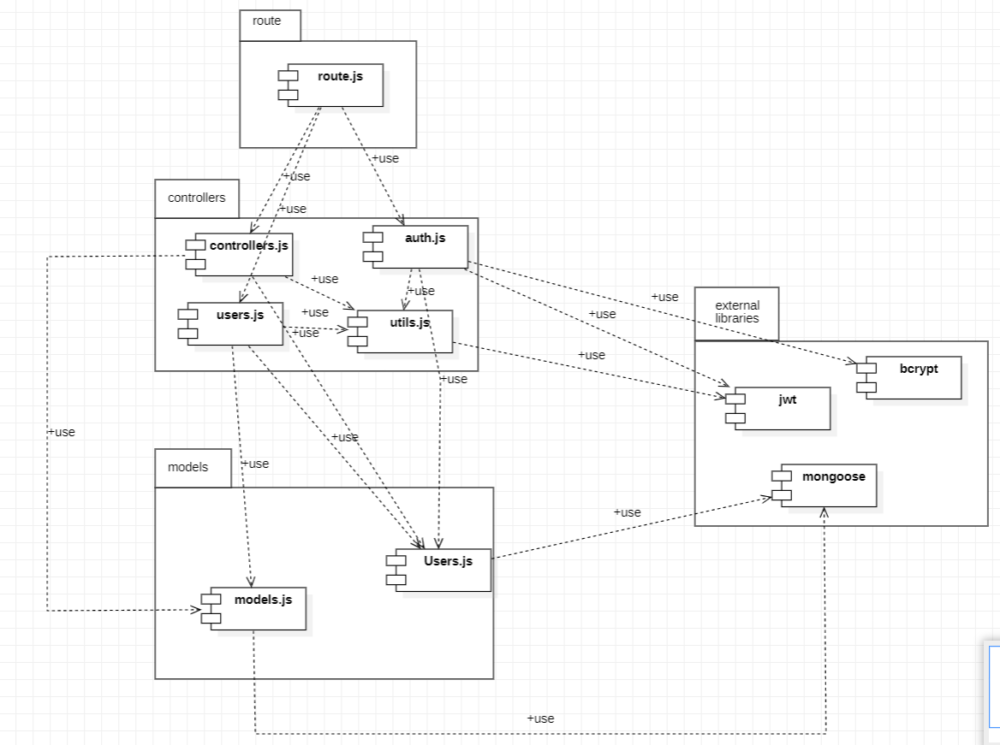

# Test Report

<The goal of this document is to explain how the application was tested, detailing how the test cases were defined and what they cover>

# Contents

- [Dependency graph](#dependency-graph)

- [Integration approach](#integration-approach)

- [Tests](#tests)

- [Coverage](#Coverage)

# Dependency graph 

     
# Integration approach
The approach used was Bottom-up, from unit testing to integration testing.
We started unit tests by mocking all the functions inherent to the libraries used (jwt, bcrypt and mongoose and external functions from utils file) and then moved on to integration tests to verify them (this approach was performed for all functions except those in utils) with API testing or testing with route.js.
    

# Tests
| Test case name | Object(s) tested | Test level | Technique used |
|--|--|--|--|
|Simple register|register|unit|Statement coverage
|Should return 400 if missing first parameters in the body|-|-|-
|Should return 400 if missing second parameters in the body|-|-|-
|Should return 400 if missing third parameters in the body|-|-|-
|Should return 400 if missing a parameter is empty|-|-|-
|Register - Email already taken|-|-|-
|Incorrect email format|-|-|-
|Username already taken|-|-|-
|Password < 8 |-|-|-
|Should return 400 on the catch|-|-|-
|-|-|-|-
|Successful registration of admin|registerAdmin|unit|Statement coverage
|Should return 400 if missing parameters in the body|-|-|-
|Should return 400 if 1 missing parameters in the body|-|-|-
|Should return 400 if 2missing parameters in the body|-|-|-
|Should return 400 if 3missing a parameter is empty|-|-|-
|Register - Email already taken|-|-|-
|Incorrect email format|-|-|-
|Username already taken|-|-|-
|Password < 8|-|-|-
|Should return 400 on the catch|-|-|-
|-|-|-|-
|Simple login|login|unit|Statement coverage
|Returns a error 400 if some req.body is absent|-|-|-
|email empty|-|-|-
|password empty|-|-|-
|Incorrect email format|-|-|-
|Supplied password does not match with the one in the database|-|-|-
|Email does not identify a user in the database|-|-|-
|Return 400 of the catch|-|-|-
|-|-|-|-
|Simple logout|logout|unit|Statement coverage
|RefreshToken not in the body=> Error 400|-|-|-
|User not found=> Error 400|-|-|-
|Error 401 on verifyAuth|-|-|-
|Return 400 of the catch|-|-|-
|Should return status 200 OK on successful
|-|-|-|-
|Should return status 200 OK on successful registration|register|integration|Statement coverage
|returns error 400 when any parameter is missing|-|-|-
|returns error 400 when any parameter is missing2|-|-|-
|returns error 400 when any parameter is empty|-|-|-
|returns error 400 when any parameter is empty1|-|-|-
|returns error 400 when any parameter is empty2|-|-|-
|returns error 400 the email format is not correct|-|-|-
|returns error 400 when the username is already taken|-|-|-
|'returns error 400 when the password lenght is < 8|-|-|-
|-|-|-|-
registration|registerAdmin|integration|Statement coverage
|returns 400 error when any 1 parameter is missing|-|-|-
|returns error 400 when any 2parameter is missing2|-|-|-
|returns error 400 when any  3parameter is empty|-|-|-
|returns error 400 the email format is not correct|-|-|-
|returns error 400 when the username is already taken|-|-|-
|returns error 400 when the password lenght is < 8|-|-|-
|-|-|-|-
|Should return status 200 OK on successful login|login|integration|Statement coverage
|returns 400 error when any parameter is missing|-|-|-
|returns error 400 when any parameter is missing2|-|-|-
|returns error 400 when any 1 parameter is empty|-|-|-
|returns error 400 when any 2 parameter is empty|-|-|-
|returns error 400 the email format is not correct|-|-|-
|'returns error 400 the email does not exists|-|-|-
|returns 400 error when the password is incorrect|-|-|-
|-|-|-|-
|Should return status 200 OK on successful logout|logout|integration|Statement coverage
|returns error 400 when refresh token is missing in cookies|-|-|-
|returns error 400 when user is not found|-|-|-
|returns error 401 when verifyAuth returns false|-|-|-
|-|-|-|-
|should return a 400 error if the request body does not contain all the necessary attributes|createCategory|unit|Statement Coverage
|Should return a 400 error if at least one of the parameters in the request body is an empty string|-|-|-
|Should return a 401 error if called by an authenticated user who is not an admin (authType = Admin)|-|-|-
|Should return a 400 error if the type of category passed in the request body represents an already existing category in the database by type search|-|-|-
|Should return a 400 error if the color of category passed in the request body represents an already existing category in the database by color search|-|-|-
|Should create a new category and return the saved data and a 200 success code|-|-|-
|-|-|-|-
|Should return a 401 error if called by an authenticated user who is not an admin (authType = Admin)|updateCategory|unit|StatementCoverage
|should return a 400 error if the request body does not contain all the necessary attributes|-|-|-
|should return a 400 error if at least one of the parameters in the request body is an empty string|-|-|-
|should return a 404 error if the parameter is empty|-|-|-
|should return a 400 error if the type of category passed as a route parameter does not represent a category in the database|-|-|-
|Should return a 400 error if the type of category passed in the request body represents an already existing category in the database by color search|-|-|-
|Should return a 400 error if the type of category passed in the request body represents an already existing category in the database by color search|-|-|-
|Should return a 400 error if the type of category passed in the request body represents an already existing category in the database by color search|-|-|-
|Should return a 200 code and a successful message for the edited category when body.type is different from the params.type|-|-|-
|Should return a 200 code and a successful message for the edited category when body.type is equal to params.type|-|-|-
|Should return a 400 error whether there are another error|-|-|-
|-|-|-|-
|Should return a 401 error if called by an authenticated user who is not an admin (authType = Admin)|deleteCategory|unit|Statement Coverage
|should return a 400 error if the request body does not contain all the necessary attributes|-|-|-
|Should return a 400 error if at least one of the types in the array is an empty string|-|-|-
|Should return a 400 error if at least one of the types in the array does not represent a category in the database|-|-|-
|Should return a 200 successful code and a confirmsation of a successful deletion and an attribute `count` that specifies the number of transactions that have had their category type changed when N = T|-|-|-
|Should return a 200 successful code and a confirmsation of a successful deletion and an attribute `count` that specifies the number of transactions that have had their category type changed when N > T|-|-|-
|Should return a 400 error if there is only 1 category in the database|-|-|-
|Should return a 400 error whether there are another error|-|-|-
|-|-|-|-
|Should return a 401 error if called by an authenticated user who is not an admin (authType = Admin)|getCategories|unit|Statement coverage
|Should return a 401 error if called by an authenticated user who is not an admin 2(authType = Admin)|-|-|-
|Should return all categories|-|-|-
|Should return a 400 error whether there are another error|-|-|-
|-|-|-|-
|Should return a 400 error if the username passed as a route parameter is an empty string or is in an invalid format|createTransaction|unit|Statement coverage
|Should return a 401 error if called by an authenticated user who is not the same user as the one in the route parameter|-|-|-
|Should return a 400 error if the username passed as a route parameter does not represent a user in the database|-|-|-
|should return a 400 error if the request body does not contain all the necessary attributes|-|-|-
|Should return a 400 error if at least one of the parameters in the request body is an empty string|-|-|-
|Should return a 400 error if the amount passed in the request body cannot be parsed as a floating value negative numbers are accepted|-|-|-
|Should return a 400 error if the username passed in the request body does not represent a user in the database|-|-|-
|Should return a 400 error if the username passed in the request body is not equal to the one passed as a route parameter|-|-|-
|"Should return a 400 error if the type of category passed in the request body does not represent a category in the database|-|-|-
|Should create a new transaction and return the saved data and a 200 success code|-|-|-
|-|-|-|-
|Should return a 401 error if called by an authenticated user who is not the same user as the one in the route parameter|getAllTransactions|unit|Statement coverage
|Should return a 200 code and all Transaction|-|-|-
|Catch Block Try|-|-|-
|-|-|-|-
|Should return the list of transaction of the user, without filters|getTransactionsByUser|unit|Statement Coverage
|Should return the list of transaction of the user, with amount filter|-|-|-
|Should return the list of transaction of the user, with min & max filters|-|-|-
|Should return the list of transaction of the user, with date filter|-|-|-
|Error on date format filters|-|-|-
|Amount use together with min and max|-|-|-
|Parameter username doesn't represent any user|-|-|-
|Not an admin|-|-|-
|Username is empty|-|-|-
|Username has invalid format|-|-|-
|-|-|-|-
|Should return the list of transaction of the user, filtered by category|getTransactionsByUserByCategory|unit|StatementCoverage
|Parameter username doesn't represent any user|-|-|-
|Parameter category doesn't represent any category in DB|-|-|-
|Not an admin|-|-|-
|Name of category is empty|-|-|-
|Username is empty|-|-|-
|Username has invalid format|-|-|-
|Category has invalid format|-|-|-
|-|-|-|-
|Should return the list of transaction of the group|getTransactionsByGroup|unit|Statement Coverage
|Parameter name doesn't represent any group|-|-|-
|User not in group|-|-|-
|Not an admin|-|-|-
|Name of group is empty|-|-|-
|Name of group has invalid format|-|-|-
|-|-|-|-
|Should return the list of transaction of the group, filtered by category|getTransactionsByGroupByCategory|unit|Statement Coverage
|Parameter name doesn't represent any group|-|-|-
|Parameter category doesn't represent any category in DB|-|-|-
|User not in group|-|-|-
|Not an admin|-|-|-
|Name of category is empty|-|-|-
|Name of group is empty|-|-|-
|Name of group has invalid format|-|-|-
|Category has invalid format|-|-|-
|-|-|-|-
|Should return the message that transaction is been deleted successfully|deleteTransaction|unit|Statement Coverage
|Should return a 400 error if you are trying to delete a category that is not yours|-|-|-
|The request body doesn't contain all attributes|-|-|-
|The id parameter is an empty string|-|-|-
|The username passed as parameter is not in the DB|-|-|-
|Id doesn't represent transaction in the DB|-|-|-
|User is not the same as that one requested|-|-|-
|Username is an empty string|-|-|-
|Username invalid format|-|-|-
|Wrong ID format|-|-|-
|-|-|-|-
|Should return the list of transactions deleted successfully|deleteTransactions|unit|Statement Coverage
|The request body doesn't contain all attributes|-|-|-
|The request body contains at least one empty string|-|-|-
|The request body contains at least one id that doesn't represent a transaction|-|-|-
|Not an admin|-|-|-
|Ids have a wrong format|-|-|-
|-|-|-|-
|Create a new category successfully|createCategory|integration|statement coverage
|The request does not contain all attribute|-|-|-
|At least one param is an empty string (type)||-|-|-
|At least one param is an empty string (color)|-|-|-
|Category already exists|-|-|-
|Color already used|-|-|-
|Not an admin|-|-|-
|-|-|-|-
|Category updated successfully (change type)|updateCategory|integration|statement coverage
|Category updated successfully (change color)|-|-|-
|Category updated successfully (change color and type)|-|-|-
|Body does not contain all attributes|-|-|-
|At least one param is empty (type)|-|-|-
|At least one param is empty (color)|-|-|-
|Type parameter in route not exists|-|-|-
|Category in body already exists|-|-|-
|Not an admin|-|-|-
|Missing category parameter|-|-|-
|-|-|-|-
|Category is deleted successfully|deleteCategory|integration|statement coverage
|List of Categories is deleted successfully|-|-|-
|All categories deleted (the oldest not, transactions are updated with it)|-|-|-
|Body does not contain all attributes|-|-|-
|Try to delete the last category|-|-|-
|At least one type empty|-|-|-
|One type not exists|-|-|-
|You are not an admin|-|-|-
|-|-|-|-
|A list of all categories returns|getCategories|integration|statement coverage
|User not authenticated|-|-|-
|-|-|-|-
|Transaction created successfully|createTransaction|integration|statement coverage
|Body does not contain all attributes|-|-|-
|A param is an empty string (username)|-|-|-
|A param is an empty string (amount)|-|-|-
|A param is an empty string (type)|-|-|-
|Category is not found|-|-|-
|Username in body and username in route are different|-|-|-
|Username in body does not exist|-|-|-
|Username in route does not exist|-|-|-
|Amount is not a number|-|-|-
|Different user|-|-|-
|Added by admin on a user|-|-|-
|Username parameter is empty string|-|-|-
|-|-|-|-
|Return the list of transactions of all users|getAllTransactions|integration|statement coverage
|User try to get all transactions||integration|statement coverage
|-|-|-|-
|User tries to get all their transactions|getTransactionsByUser|integration|statement coverage
|User tries to get all their transactions filtered by date|-|-|-
|User tries to get all their transactions filtered by date (from)|-|-|-
|User tries to get all their transactions filtered by date (upTo)|-|-|-
|User tries to get all their transactions filtered by date (from & upTo)|-|-|-
|Filters (on date) do not match any transaction|-|-|-
|User tries to get all their transactions filtered by amount|-|-|-
|User tries to get all their transactions filtered by amount (min)|-|-|-
|User tries to get all their transactions filtered by amount (max)|-|-|-
|User tries to get all their transactions filtered by amount (min & max)|-|-|-
|User tries to get all their transactions filtered by amount (min & max) and by date (from & upTo)|-|-|-
|User tries to get all their transactions filtered by amount and by date|-|-|-
|User passed as parameter is not memorized in DB|-|-|-
|User authenticated and the request one are different|-|-|-
|User tries to use admin api|-|-|-
|Admin gets transactions of a User|-|-|-
|Username parameter is missing|-|-|-
|-|-|-|-
|User gets all their transactions filtered by category|getTransactionsByUserByCategory|integration|statement coverage
|Category not exists|-|-|-
|User passed as parameter not exists|-|-|-
|User authenticated and the requested one are different|-|-|-
|User tries to use admin api|-|-|-
|Admin gets transactions of user filtered by category|-|-|-
|-|-|-|-
|User gets transactions of their own group|getTransactionsByGroup|integration|statement coverage
|Group does not exist|-|-|-
|User not in this group|-|-|-
|User tries to use admin api|-|-|-
|Admin gets transactions of a group|-|-|-
|-|-|-|-
|User gets transactions of their own group filtered by category|getTransactionsByGroupByCategory|integration|statement coverage
|Category not exists|-|-|-
|Group not exists|-|-|-
|User is not in the group|-|-|-
|User tries to use admin api|-|-|-
|Admin gets group transactions filtered by category|-|-|-
|Group parameter is missing|-|-|-
|Group parameter is missing|-|-|-
|-|-|-|-
|User delete one of their transactions|deleteTransaction|integration|statement coverage
|Missing id in req body|-|-|-
|User not found|-|-|-
|Transaction not exists|-|-|-
|Transaction of another user|-|-|-
|User authenticated and requested are different|-|-|-
|Id format invalid|-|-|-
|Username parameter is missing|-|-|-
|-|-|-|-
|Admin deletes transactions|deleteTransactions|integration|statement coverage
|At least one id is empty|-|-|-
|Missing ids in body|-|-|-
|At least one transaction does not exist|-|-|-
|Id not valid|-|-|-
|-|-|-|-
|Should return a 401 error if user not authenticated|removeFromGroup|integration|statement coverage
|Should return a 400 error if the group name is not passed as a route parameter|-|-|-
|Should return a 401 error if the user is not an admin|-|-|-
|Regular user Should return error 401 if trying the admin Route|-|-|-
|Should return a 401 error if called by an authenticated user who is not part of the group (authType = Group) if the route is|-|-|-
|Regular user Should a 400 error if all the provided emails represent users that do not belong to the group or do not exist in the database|-|-|-
|Admin user Should a 400 error if all the provided emails represent users that do not belong to the group or do not exist in the database|-|-|-
|Regular user Should a 400 error if the group contains only one member before deleting any user|-|-|-
|Admin user Should a 400 error if the group contains only one member before deleting any user|-|-|-
|Regular User Should return a 400 error if at least one of the emails is not in a valid email format or is an empty string|-|-|-
|Admin User Should return a a 400 error if at least one of the emails is not in a valid email format or is an empty string|-|-|-
|Regular User Should return a 400 error if the group name passed as a route parameter does not represent a group in the database|-|-|-
|Admin User Should return a 400 error if the group name passed as a route parameter does not represent a group in the database|-|-|-
|Regular User Should return a 200 success code if the body user is removed|-|-|-
|Admin User Should return a 200 success code if the body user is removed|-|-|-
|-|-|-|-
|Return 200 OK|deleteUser|integration|statement coverage
|Return 200 and delete the group if the user is the last in the group|-|-|-
|Return 200 and do not delete the group if there are other members in the group|-|-|-
|Return 401 verifyAuth|-|-|-
|Return 400 Missing attribute in the request body|-|-|-
|Return 400 if the parameter is empty in the request body|-|-|-
|Return 400 email format is not correct|-|-|-
|Return 400 User not found|-|-|-
|-|-|-|-
|returns a 200 OK response when a valid group name is provided with a valid refresh token|deleteGroup|integration|statement coverage
|returns a 400 error response when the group name is empty|-|-|-
|returns a 400 error response when the group name is missing in the parameters|-|-|-
|returns a 401 error if called by an authenticated user who is not an admin (authType = Admin)|-|-|-
|returns a 400 Group doesnt exist|-|-|-
|-|-|-|-
|should return error 401 if  called by an authenticated user who is not an admin|getUsers|integration|statement coverage
|should return empty list if there are no users|-|-|-
|should retrieve list of all users|-|-|-
|-|-|-|-
|Should return the user's data given by the parameter|getUser|integration|statement coverage
|should return error 401 if  called by an authenticated user who is neither admin or the user to be found|-|-|-
|Should return 400 error if the user not found|-|-|-
|Should Returns a 400 error, and separately the list of all invalid emails|
|-|-|-|-
createGroup|integration|statement coverage
|Should Returns an group Object, and separately the emails that where already in a group or doesn't exists|-|-|-
|Should Returns a 400 error if the request body does not contain all the necessary attributes|-|-|-
|Should Returns a 401 error if called by a user who is not authenticated|-|-|-
|Should  Returns a 400 error if the group name passed in the request body is an empty string|-|-|-
|Should Returns a 400 error if the group name passed in the request body represents an already existing group in the database|-|-|-
|Should Returns a 400 error if the user who calls the API is already in a group|-|-|-
|Should Returns a 400 error if all emails are already in group or does not exists|-|-|-
|-|-|-|-
|Should return 200 & the list of all the groups|getGroups|integration|statement coverage
|Should return 401 for the verifyAuth|-|-|-
|-|-|-|-
|Should returns the group if called by admin|getGroup|integration|statement coverage
|Should returns error 400 if the groupName is not associatied with a group, called by Admin|-|-|-
|Should returns error 400 if the groupName is not associatied with a group, called by Regular|-|-|-
|Should returns error 401 if the user is not associated with that groupName passed by params, called by Regular|-|-|-
|Should returns the group if caller is a normal user|-|-|-
|Missing access token|-|-|-
|Missing refresh token|-|-|-
|-|-|-|-
|Should add members to the group and display if called by admin|addToGroup|integration|statement coverage
|Should return error 401 if a Regular user try the admin Route|-|-|-
|Should add members to the group and display if called by Regular|-|-|-
|Should returns error 401 if the  user is not authorized for that Group|-|-|-
|User...Should returns error 400 if the  group does not exists|-|-|-
|Admin...Should returns error 400 if the  group does not exists|-|-|-
|Should returns error 400 if the email array is missing|-|-|-
|Regular User Should returns error 400 if the email array is empty|-|-|-
|Admin -- Should returns error 400 if the email array is empty|-|-|-
|Admin-Should returns error 400 if some email are invalid|-|-|-
|Regular-Should returns error 400 if some email are invalid ,Regular|-|-|-
|Should returns error 404 if the param  is empty,Regular User|-|-|-
|AdminRouteShould returns error 404 if the param  is empty|-|-|-
|Regular user Should returns error 400 if all email does not exists or are already in a group|-|-|-
|Admin Route Should returns error 400 if all email does not exists or are already in a group|-|-|-
|--|--|--|--|
|should return error 401 if  called by an authenticated user who is not an admin|getUsers|unit|Statement coverage
|Catch Block Test|-|-|-
|should return empty list if there are no users|-|-|-
|should retrieve list of all users|-|-|-
|-|-|-|-
|Should return the user's data given by the parameter|getUser|unit|StatementCoverage
|Catch Block Test|-|-|-
|Should return error 401 if  called by an authenticated user who is neither admin or the user to be found|-|-|-
|Should return 400 error if the user not found|-|-|-
|Should return error 404 if the username param is empty|-|-|-
|-|-|-|-
|Should Return a 400 error, and separately the list of all invalid emails|createGroup|unit|StatementCoverage
|Catch Block Try|-|-|-
|Should Return an group Object, and separately the emails that where already in a group or doesn't exists|-|-|-
|Should Return a 400 error if the request body does not contain all the necessary attributes|-|-|-
|Should Return a 401 error if called by a user who is not authenticated|-|-|-
|Should  Return a 400 error if the body miss some parameter in the request body is an empty string|-|-|-
|Should Return a 400 error if the group name passed in the request body represents an already existing group in the database|-|-|-
|Should Return a 400 error if the user who calls the API is already in a group|-|-|-
|Should Return a 400 error if all emails are already in group|-|-|-
|Should Return a 400 error if all member emails doensnt exists|-|-|-
|Should Return a 400 error if all member emails doensnt exists|-|-|-
|-|-|-|-
|Should return all  groups|getGroups|unit|StatementCoverage
|Catch Block Try|-|-|-
|Should return error 401 if is not called by an admin |-|-|-
|-|-|-|-
|Should return the group if called by admin|getGroup|unit|StatementCoverage
|Should return error 400 if  the groupName is not associatied with a  group,called by Admin|-|-|-
|Should return error 400 if  the groupName is not associatied with a  group,called by Admin|-|-|-
|Should return error 400 if  the groupName is not associatied with a  group,called by Regular|-|-|-
|Should return error 401 if  the user is not associated with that groupName passed by params,called by Regular|-|-|-
|Should return error 401 if the admin is not authorized|-|-|-
|Should returns the group if caller is a normal user|-|-|-
|Catch Block Try|-|-|-
|Should return error 404 if the param is empty|-|-|-
|Should return error 401 if the body misses some cookies|-|-|-
|Should return error 401 if the refresh token is not associated with an User|-|-|-
|-|-|-|-
|Should add members to the group and display if called by admin|addToGroup|unit|StatementCoverage
|Should return error 401 if a Regular user try the admin Route |-|-|-
|Should add members to the group and display if called by Regular|-|-|-
|Should return error 401 if the  user is not authorized for that Group|-|-|-
|Should return error 400 if the  group does not exists|-|-|-
|Should return error 401 if the admin is not authorized |-|-|-
|Should return error 400 if the email array is missing|-|-|-
|Should return error 400 if the email array is empty|-|-|-
|Should return error 400 if the email array is empty Regular|-|-|-
|Should return error 400 if the groupName doesnt match with an existings one |-|-|-
|Should return error 400 if some email are invalid|-|-|-
|Should returns error 400 if some email are invalid Regular|-|-|-
|Should returns error 404 if the param  is empty|-|-|-
|Should returns error 404 if the param  is empty Regular User |-|-|-
|Catch Block Try|-|-|-
|Should returns error 400 if all email does not exists or are already in a group , if called by admin |-|-|-
|Should returns error 400 if all email does not exists or are already in a group , if called by Regular|-|-|-
|-|-|-|-
|Should return error 401 if a Regular user try the admin Route|removeFromGroup|unit|StatementCoverage
|Should return error 401 if the user is not authorized for that group |-|-|-
|Should return error 400 if the group final lenght is 1 |-|-|-
|Catch Block Try|-|-|-
|Should return error 400 if the group does not exist,Regular|-|-|-
|Should return error 400 if some email are invalid |-|-|-
|Should remove members to the group and display if called by admin|-|-|-
|Should return error 400 if some email are invalid|-|-|-
|Should remove members to the group and display if called by regular user|-|-|-
|Should return error 400 if we end with a group with lenght 1|-|-|-
|Should return error 400 if all provided emails does not exists or don't belong to the group|-|-|-
|Should return error 400 if all provided emails does not exists or don't belong to the group,Regular|-|-|-
|Should return error 400 if the group does not exists, Admin Route|-|-|-
|Should return error 401 if the admin is not authorized, Admin Route |-|-|-
|Should return error 400 if the calling user does not exists, Admin Route|-|-|-
|Should return error 404 if some params are missing, Admin Route|-|-|-
|-|-|-|-
|Should delete user  called by admin and delete the group|deleteUser|unit|StatementCoverage
|Should delete user  called by admin,no group|-|-|-
|Should return error 401 if the admin is not authroized |-|-|-
|Should return error 400 if the user to delete does not exists|-|-|-
|Catch Block Try|-|-|-
|-|-|-|-
|Should remove  the group and display if called by admin|deleteGroup|unit|StatementCoverage
|Should return error 401 if the admin is not authorized|-|-|-
|Should return error 400 if the groupname is missing|-|-|-
|Should return error 400 if the groupname is empty|-|-|-
|Should return error 400 if the grouptest does not exists|-|-|-
|Catch Block Try|-|-|-
|-|-|-|-
| Date Invalid Format |handleDateFilterParams|unit|statement coverage
|from Invalid Format |-|-|-
|upto Invalid Format|-|-|-
|Return object error if the query contains date from and upto all together|-|-|-
|Return query with date information||-|-|-
|Return query with from and upTo information|-|-|-
|Return query with from  information|-|-|-
|Return query with upTo information|-|-|-
|Return nothing is query is missing|-|-|-
|-|-|-|-
|should return the number if valid|handleNumber|unit|statement coverage
|should parse and return the number from a valid string|-|-|-
|should handle comma as decimal separator in string input|-|-|-
|should throw an error if the number is missing|-|-|-
|should throw an error if the input is not a number or string||-|-|-
|should throw an error if the string input is in an invalid format|-|-|-
|-|-|-|-
|Catch Block try|verifyAuth|unit|statement coverage
|Return flag to false and the message error if we mess the token in the headers|-|-|-
|Test verify with admin|-|-|-
|Return object error if the acces token are not associated with a user|-|-|-
|Return object error if the refresh token are not associated with a user|-|-|-
|Test verify with Regular User|-|-|-
|Return object error if the refresh token give us different user information  against the acces token|-|-|-
|Return object error if the Tokens have a different username from the requested one,User control|-|-|-
|Return object error if you are trying admin authorization without having the permissions|-|-|-
|Return object error if Tokens have a different username from the requested one, test User/admin|-|-|-
|Return object error if the email is not in the group|-|-|-
|Return true if the access is granted for group authorization|-|-|-
|access token expired Test verify with admin|-|-|-
|access token expired Test verify with Regular User|-|-|-
|access token expired,Return object error if the Tokens have a different username from the requested one,User control|-|-|-
|access token expired,Return object error if you are trying admin authorization without having the permissions|-|-|-
|access token expired,Return object error if Tokens have a different username from the requested one, test User/admin|-|-|-
|access token expired,Return object error if the email is not in the group|-|-|-
|access token expired,Return true if the access is granted for group authorization|-|-|-
|Return object error if the refresh token expired(need to perform login again)|-|-|-
|access token expired,Catch Block try|-|-|-
|-|-|-|-
|should return true for valid JSON string|isJsonString|unit|statement coverage
|should return false for invalid JSON string|-|-|-
|-|-|-|-
|Return object error if the query contains date from and upto all together|handleAmountFilterParams|unit|statement coverage
|Return query with amount information|-|-|-
|Return query with min information|-|-|-
|Return query with max information|-|-|-
|Return query with max and min information|-|-|-
|Return nothing is query is missing|-|-|-
|-|-|-|-
|should return the trimmed lowercase string if valid|handleString|unit|statement coverage
|should throw an error if the input is not a string|-|-|-
|should throw an error if the string is empty||-|-|-

# Coverage

## Coverage of FR

| Functional Requirements covered |   Test(s) | 
| ------------------------------- | ----------- | 
|FR11 | Register :   Test Suite (Integration +Unit)
|FR13| logout:   Test Suite (Integration +Unit)| 
|FR14| registerAdmin:   Test Suite (Integration +Unit) | 
|FR15| getUsers:   Test Suite (Integration +Unit) |
|FR16 | getUser:   Test Suite (Integration +Unit) | 
|FR17 | deleteUser:   Test Suite (Integration +Unit)|
|FR21 | createGroup :   Test Suite (Integration +Unit)| 
|FR22| getGroups :   Test Suite (Integration +Unit)| 
|FR23| getGroup :   Test Suite (Integration +Unit)| 
|FR24| addToGroup :   Test Suite (Integration +Unit)| 
|FR26| removeFromGroup:   Test Suite (Integration +Unit) | 
|FR28| deleteGroup:   Test Suite (Integration +Unit) | 
|FR31| createTransaction:   Test Suite (Integration +Unit)| 
|FR32| getAllTransactions:   Test Suite (Integration +Unit) | 
| FR33| getTransactionsByUser:   Test Suite (Integration +Unit) | 
| FR34| getTransactionsByUserByCategory:   Test Suite (Integration +Unit)| 
| FR35| getTransactionsByGroup :   Test Suite (Integration +Unit)| 
| FR36| getTransactionsByGroupByCategory :   Test Suite (Integration +Unit)|
| FR37| deleteTransaction :   Test Suite (Integration +Unit)|
| FR38| deleteTransactions :   Test Suite (Integration +Unit)|
| FR41| createCategory :   Test Suite (Integration +Unit)| 
| FR42| updateCategory :   Test Suite (Integration +Unit)| 
| FR43| deleteCategory :   Test Suite (Integration +Unit)|
| FR44 | getCategories :   Test Suite (Integration +Unit)| 

## Coverage white box

